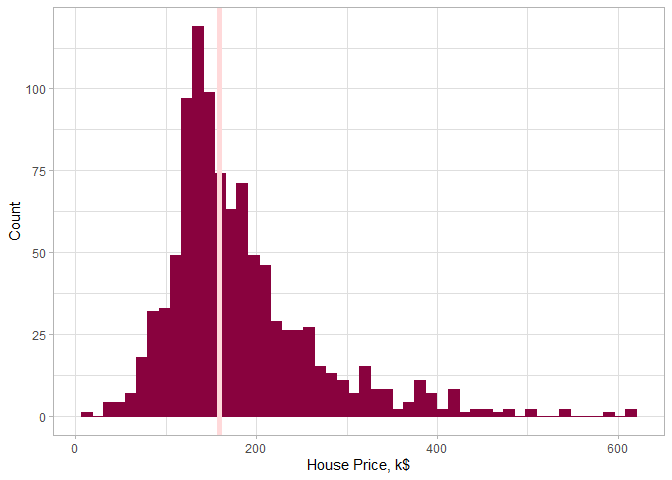
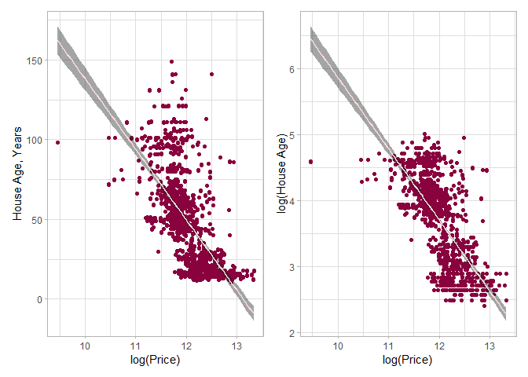
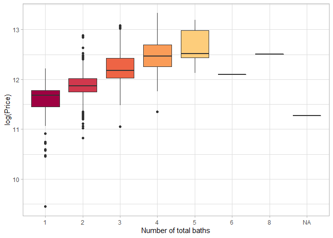
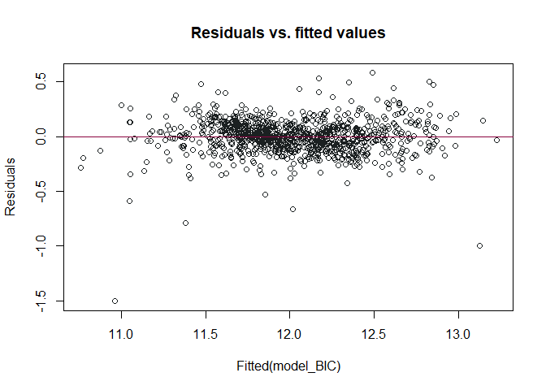
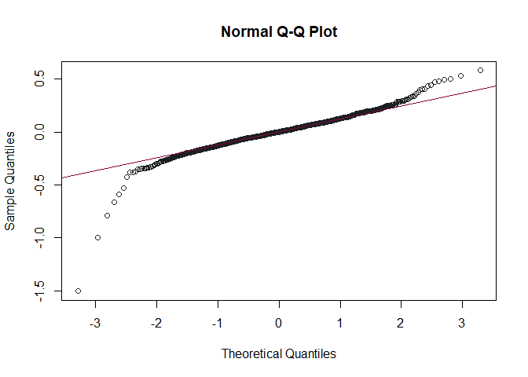
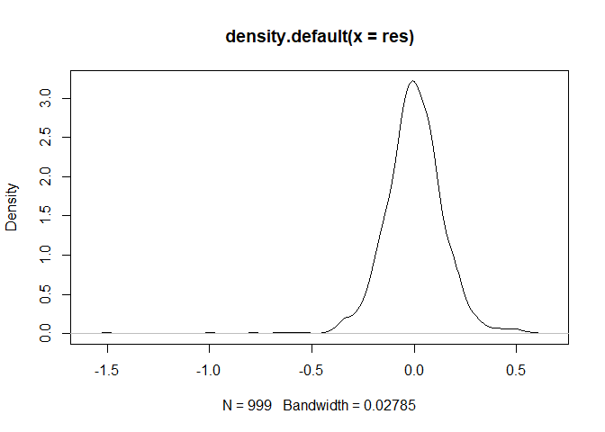
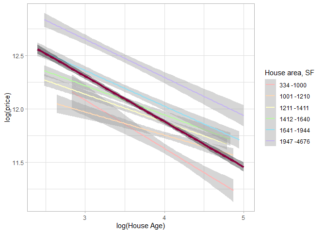
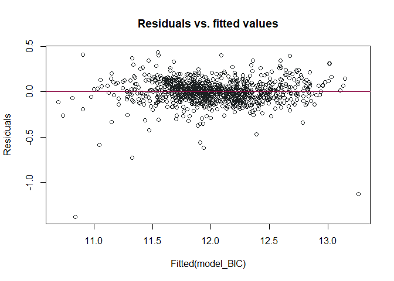
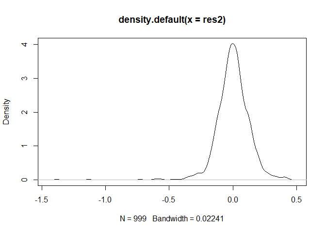

# Background

As a statistical consultant working for a real estate investment firm,
the task is to develop a model to predict the selling price of a given
home in Ames, Iowa. The employer hopes to use this information to help
assess whether the asking price of a house is higher or lower than the
true value of the house. If the home is undervalued, it may be a good
investment for the firm.

# Training Data and relevant packages

In order to better assess the quality of the model we will produce, the
data have been randomly divided into three separate pieces: a training
data set, a testing data set, and a validation data set. For now we will
load the training data set, the others will be loaded and used later.

``` r
load("ames_train.Rdata")
```

Necessary packages

``` r
library(statsr)
library(dplyr)
library(Hmisc)
library(BAS)
library(patchwork)
library(RColorBrewer)
library(forcats)
library(broom)
library(Rcpp)
library(jtools)
library(ggplot2)
library(MASS)
```

## Part 1 - Exploratory Data Analysis (EDA)

-----

First, we will explore our response variable - the **price** of a house
- to establish the distribution of the data and decide whether any
transformations of the variable are needed.

``` r
ggplot(ames_train, aes(x = price/1000)) +
  geom_histogram(bins = 50, freq=F, colour = "#89023E", fill = "#89023E")+
  geom_vline(xintercept = median(ames_train$price/1000), color="#FFD9DA", size=2)+
  xlab("House Price, k$") + ylab("Count")+
  theme_light()
```

<!-- -->

``` r
summary(ames_train$price)
```

    ##    Min. 1st Qu.  Median    Mean 3rd Qu.    Max. 
    ##   12789  129763  159467  181190  213000  615000

The histogram above shows the price of a house measured in thousand
dollars and the corresponding counts of houses in that price range. The
data is unimodal and right skewed with the mean around 160 thousand
dollars(pink vertical line).

Interestingly, as the summary statistics and the histogram suggest, on
the lower price end 25% of the houses are priced in the range of 128 and
130 thousand dollars but on the higher price end - in the range of
213-615 thousand dollars, which indicated a significant right-skewness
of the data.

The data is not normally distributed because the value of `price`
variable must be greater than 0 the data is highly right-skewed, and
thus will be log-transformed for further analysis.

``` r
ames_train$log_price<-log(ames_train$price)
```

Next, we will explore the relationship between the age of a house and
its price. To do so, we will introduce a new variable **House.Age**.

``` r
ames_train$House.Age <- 2021 - ames_train$Year.Built
```

``` r
p5<-ggplot(data = ames_train, aes(x =log_price , y = House.Age)) +
        geom_point(colour = "#89023E") +
        geom_jitter(colour = "#89023E")+
        geom_smooth(method = "lm", color =  "#FFD9DA", fill="#1B2021")+
        xlab("log(Price)") + ylab("House Age, Years")+
        theme_light()

p6<-ggplot(data = ames_train, aes(x =log_price , y = log(House.Age))) +
        geom_point(colour = "#89023E") +
        geom_jitter(colour = "#89023E")+
        geom_smooth(method = "lm", color =  "#FFD9DA", fill="#1B2021")+
        xlab("log(Price)") + ylab("log(House Age)")+
        theme_light()

p5+p6
```

    ## `geom_smooth()` using formula 'y ~ x'
    ## `geom_smooth()` using formula 'y ~ x'

<!-- -->

The plots above ‘House.Age’ vs ‘log\_price’ and ‘log(House.Age)’ vs
‘log\_price’ both show a linear relation between the variable, however
‘log(House.Age)’ vs ‘log\_price’ visually show a better correlation.

``` r
cor5<-signif(cor(ames_train$log_price, ames_train$House.Age, method = "pearson"), digits=2)
cor6<-signif(cor(ames_train$log_price, log(ames_train$House.Age), method = "pearson"), digits=2)
print(paste("The correlation coefficient between log(Price) and Lot Area is",cor5, ". The correlation coefficient between log(Price) and log(House.Age) is",cor6))
```

    ## [1] "The correlation coefficient between log(Price) and Lot Area is -0.63 . The correlation coefficient between log(Price) and log(House.Age) is -0.68"

that shows association between two variables further confirms that
‘log(House.Age)’ vs ‘log\_price’ have a stronger association because
of a higher correlation coefficient.

Therefore from our analysis we conclude that ‘log\_price’ and
‘House.Age’ are correlated variables and ‘House.Age’ should be
log-transformed for further analysis.

A similar exploratory data analysis was done for ‘area’ and ‘Lot.Area’
variables and it was decided to log-transform them as well.

``` r
ames_train$log_area<-log(ames_train$area)
ames_train$log_Lot.Area<-log(ames_train$Lot.Area)
ames_train$log_House.Age<-log(ames_train$House.Age)
```

Lastly, we will look at the correlation between the total amount of
baths in the house and its price. Here we introduce a new variable
‘total\_bath’ that is a sum of full and half baths in the house.

``` r
ames_train$total_bath<-ames_train$Bsmt.Full.Bath+ames_train$Bsmt.Half.Bath+ames_train$Full.Bath+ames_train$Half.Bath


by_total_bath<- ames_train %>% group_by(total_bath)
by_total_bath$total_bath<- as.factor(by_total_bath$total_bath)
nb.cols=12
mycolors <- colorRampPalette(brewer.pal(12, "Spectral"))(nb.cols)
ggplot(by_total_bath, aes(x=total_bath, y=log_price, fill=total_bath)) + 
    geom_boxplot()+
    xlab("Number of total baths") + ylab("log(Price)")+
    theme_light()+
    scale_fill_manual(values = mycolors)+
    theme(legend.position = "none")
```

<!-- -->

The boxplot above shows that as the number of baths in the house
increases so does the price of a house. The mean price for 6 and 8 baths
in the house is lower than for 5 houses that might be explained by the
low number of data available for houses that has more than 5 baths.
Also, 5 baths has the widest box, that is the highest IQR, suggesting a
larger distribution of house prices for this amount of baths in the
house.

Overall the plot suggests a linear relation between the ‘log\_price’ and
‘total\_bath’ variables thus ‘total\_bath’ variable will be included in
the modeling of ‘log\_price’.

-----

## Part 2 - Development and assessment of an initial model, following a semi-guided process of analysis

### Section 2.1 An Initial Model

-----

Based on the literature research online *([8 critical factors that
influence a home’s
value](https://www.opendoor.com/w/blog/factors-that-influence-home-value),[6
factors that influence a home’s
value](https://www.inman.com/2017/08/07/6-factors-that-influence-a-homes-value/))*
location, size, overall condition, usable space are influencing the
house price. Therefore ‘Neighborhood’, ‘log\_House.Age’, ‘log\_area’,
‘log\_Lot.Area’, ‘Overall.Cond’ were added based on the previous
research and EDA that showed a linear association between these
variables and ‘log\_price’. ‘total\_bath’ and ‘TotRms.AbvGrd’ were added
to reflect the usable space in the house; also these variables showed an
association with house price in the EDA. ‘Heating.QC’ was selected as a
parameter for the condition of the house and heating could be an
important factor in Ames, where the temperature from September to May
falls below 10 degrees C. Finally, ‘Sale\_Condition’ was selected as the
price of the house varies greatly whether it was a normal sale, abnormal
sale or partial sale.

``` r
model_0 <- lm((log_price) ~ log_Lot.Area + log_area + Overall.Cond + Heating.QC + log_House.Age + Sale.Condition + Neighborhood + total_bath +TotRms.AbvGrd, data = ames_train)

summ(model_0)
```

    ## MODEL INFO:
    ## Observations: 999 (1 missing obs. deleted)
    ## Dependent Variable: (log_price)
    ## Type: OLS linear regression 
    ## 
    ## MODEL FIT:
    ## F(41,957) = 153.98, p = 0.00
    ## R² = 0.87
    ## Adj. R² = 0.86 
    ## 
    ## Standard errors: OLS
    ## ----------------------------------------------------------
    ##                                Est.   S.E.   t val.      p
    ## --------------------------- ------- ------ -------- ------
    ## (Intercept)                    7.11   0.22    32.13   0.00
    ## log_Lot.Area                   0.15   0.01    10.88   0.00
    ## log_area                       0.57   0.03    17.95   0.00
    ## Overall.Cond                   0.08   0.01    15.43   0.00
    ## Heating.QCFa                  -0.11   0.04    -2.99   0.00
    ## Heating.QCGd                  -0.01   0.02    -0.73   0.47
    ## Heating.QCPo                   0.08   0.16     0.51   0.61
    ## Heating.QCTA                  -0.04   0.01    -2.46   0.01
    ## log_House.Age                 -0.27   0.02   -13.81   0.00
    ## Sale.ConditionAdjLand          0.04   0.12     0.34   0.74
    ## Sale.ConditionAlloca           0.19   0.08     2.36   0.02
    ## Sale.ConditionFamily           0.01   0.04     0.15   0.88
    ## Sale.ConditionNormal           0.10   0.02     4.71   0.00
    ## Sale.ConditionPartial          0.12   0.03     3.99   0.00
    ## NeighborhoodBlueste            0.00   0.10     0.03   0.97
    ## NeighborhoodBrDale            -0.11   0.07    -1.48   0.14
    ## NeighborhoodBrkSide           -0.07   0.06    -1.14   0.26
    ## NeighborhoodClearCr           -0.08   0.07    -1.17   0.24
    ## NeighborhoodCollgCr           -0.13   0.05    -2.45   0.01
    ## NeighborhoodCrawfor            0.07   0.06     1.08   0.28
    ## NeighborhoodEdwards           -0.18   0.06    -3.28   0.00
    ## NeighborhoodGilbert           -0.21   0.06    -3.86   0.00
    ## NeighborhoodGreens             0.34   0.09     3.67   0.00
    ## NeighborhoodGrnHill            0.33   0.12     2.70   0.01
    ## NeighborhoodIDOTRR            -0.25   0.06    -4.09   0.00
    ## NeighborhoodMeadowV           -0.22   0.06    -3.34   0.00
    ## NeighborhoodMitchel           -0.10   0.06    -1.70   0.09
    ## NeighborhoodNAmes             -0.08   0.06    -1.44   0.15
    ## NeighborhoodNoRidge            0.04   0.06     0.74   0.46
    ## NeighborhoodNPkVill            0.01   0.09     0.10   0.92
    ## NeighborhoodNridgHt            0.11   0.05     1.98   0.05
    ## NeighborhoodNWAmes            -0.12   0.06    -1.98   0.05
    ## NeighborhoodOldTown           -0.18   0.06    -3.06   0.00
    ## NeighborhoodSawyer            -0.09   0.06    -1.58   0.11
    ## NeighborhoodSawyerW           -0.20   0.06    -3.70   0.00
    ## NeighborhoodSomerst           -0.04   0.05    -0.86   0.39
    ## NeighborhoodStoneBr            0.19   0.06     3.20   0.00
    ## NeighborhoodSWISU             -0.06   0.07    -0.80   0.42
    ## NeighborhoodTimber             0.02   0.06     0.34   0.73
    ## NeighborhoodVeenker           -0.02   0.07    -0.28   0.78
    ## total_bath                     0.04   0.01     4.50   0.00
    ## TotRms.AbvGrd                 -0.02   0.01    -3.64   0.00
    ## ----------------------------------------------------------

The adjusted R squared of the initial model is 0.86, meaning that 86% of
the variation of ‘log\_price’ can be explained by the set of selected
variables. Further looking ar the p value of the variables, the most of
them have the p value close to 0. This means that the probability of
‘log\_price’ and these variables having no relationship is very low.
Some of the subcategories ‘Neighborhood’, ‘Sale.Condition’ and
‘Heating.QC’ have a high p-value however since at least one of the
categories in these variables has a significant p-value, that is a
p-value lower than 0.05, we cannot dismiss these variables. In summary,
the model adjusted R-squared value and the low p-values of all selected
variables suggest that all the variables could be important predictors
of ‘log\_price’ of houses in Ames.

-----

### Section 2.2 Model Selection

-----

Using `stepAIC` selection procedure we will pick the “best” model, using
the initial model as the starting point. We will use two different model
selection methods - AIC and BIC.

AIC, Akaike Information Criterion, is calculated from the number of
parameters in the model and the likelihood of the model. The lower the
value of the model, the better the model is predicting the independent
variable.

``` r
model_AIC <- stepAIC(model_0, k = 2)
```

    ## Start:  AIC=-3675.26
    ## (log_price) ~ log_Lot.Area + log_area + Overall.Cond + Heating.QC + 
    ##     log_House.Age + Sale.Condition + Neighborhood + total_bath + 
    ##     TotRms.AbvGrd
    ## 
    ##                  Df Sum of Sq    RSS     AIC
    ## <none>                        23.190 -3675.3
    ## - Heating.QC      4    0.3064 23.497 -3670.1
    ## - TotRms.AbvGrd   1    0.3209 23.511 -3663.5
    ## - total_bath      1    0.4914 23.682 -3656.3
    ## - Sale.Condition  5    0.7326 23.923 -3654.2
    ## - log_Lot.Area    1    2.8689 26.059 -3560.7
    ## - log_House.Age   1    4.6189 27.809 -3495.8
    ## - Overall.Cond    1    5.7658 28.956 -3455.4
    ## - Neighborhood   26    8.9214 32.112 -3402.1
    ## - log_area        1    7.8073 30.998 -3387.4

``` r
summ(model_AIC)
```

    ## MODEL INFO:
    ## Observations: 999 (1 missing obs. deleted)
    ## Dependent Variable: (log_price)
    ## Type: OLS linear regression 
    ## 
    ## MODEL FIT:
    ## F(41,957) = 153.98, p = 0.00
    ## R² = 0.87
    ## Adj. R² = 0.86 
    ## 
    ## Standard errors: OLS
    ## ----------------------------------------------------------
    ##                                Est.   S.E.   t val.      p
    ## --------------------------- ------- ------ -------- ------
    ## (Intercept)                    7.11   0.22    32.13   0.00
    ## log_Lot.Area                   0.15   0.01    10.88   0.00
    ## log_area                       0.57   0.03    17.95   0.00
    ## Overall.Cond                   0.08   0.01    15.43   0.00
    ## Heating.QCFa                  -0.11   0.04    -2.99   0.00
    ## Heating.QCGd                  -0.01   0.02    -0.73   0.47
    ## Heating.QCPo                   0.08   0.16     0.51   0.61
    ## Heating.QCTA                  -0.04   0.01    -2.46   0.01
    ## log_House.Age                 -0.27   0.02   -13.81   0.00
    ## Sale.ConditionAdjLand          0.04   0.12     0.34   0.74
    ## Sale.ConditionAlloca           0.19   0.08     2.36   0.02
    ## Sale.ConditionFamily           0.01   0.04     0.15   0.88
    ## Sale.ConditionNormal           0.10   0.02     4.71   0.00
    ## Sale.ConditionPartial          0.12   0.03     3.99   0.00
    ## NeighborhoodBlueste            0.00   0.10     0.03   0.97
    ## NeighborhoodBrDale            -0.11   0.07    -1.48   0.14
    ## NeighborhoodBrkSide           -0.07   0.06    -1.14   0.26
    ## NeighborhoodClearCr           -0.08   0.07    -1.17   0.24
    ## NeighborhoodCollgCr           -0.13   0.05    -2.45   0.01
    ## NeighborhoodCrawfor            0.07   0.06     1.08   0.28
    ## NeighborhoodEdwards           -0.18   0.06    -3.28   0.00
    ## NeighborhoodGilbert           -0.21   0.06    -3.86   0.00
    ## NeighborhoodGreens             0.34   0.09     3.67   0.00
    ## NeighborhoodGrnHill            0.33   0.12     2.70   0.01
    ## NeighborhoodIDOTRR            -0.25   0.06    -4.09   0.00
    ## NeighborhoodMeadowV           -0.22   0.06    -3.34   0.00
    ## NeighborhoodMitchel           -0.10   0.06    -1.70   0.09
    ## NeighborhoodNAmes             -0.08   0.06    -1.44   0.15
    ## NeighborhoodNoRidge            0.04   0.06     0.74   0.46
    ## NeighborhoodNPkVill            0.01   0.09     0.10   0.92
    ## NeighborhoodNridgHt            0.11   0.05     1.98   0.05
    ## NeighborhoodNWAmes            -0.12   0.06    -1.98   0.05
    ## NeighborhoodOldTown           -0.18   0.06    -3.06   0.00
    ## NeighborhoodSawyer            -0.09   0.06    -1.58   0.11
    ## NeighborhoodSawyerW           -0.20   0.06    -3.70   0.00
    ## NeighborhoodSomerst           -0.04   0.05    -0.86   0.39
    ## NeighborhoodStoneBr            0.19   0.06     3.20   0.00
    ## NeighborhoodSWISU             -0.06   0.07    -0.80   0.42
    ## NeighborhoodTimber             0.02   0.06     0.34   0.73
    ## NeighborhoodVeenker           -0.02   0.07    -0.28   0.78
    ## total_bath                     0.04   0.01     4.50   0.00
    ## TotRms.AbvGrd                 -0.02   0.01    -3.64   0.00
    ## ----------------------------------------------------------

The AIC model selected the initial model as the one with lowest AIC
score, thus all the selected variables are deemed to be useful based on
AIC.

BIC, Bayesian Information Criterion, is calculated from the likelihood
of the model, the number of examples in the training dataset, the number
of parameters in the model. Even though AIC and BIC are using similar
parameters in their calculation, BIC is more conservative and penalizes
the model more if it is complex. Similarly as with AIC, the lower the
score of the BIC the better.

``` r
k.BIC = log(nrow(ames_train))-1 # minus one because one observation was removed
model_BIC <- stepAIC(model_0, k = k.BIC)
```

    ## Start:  AIC=-3511.13
    ## (log_price) ~ log_Lot.Area + log_area + Overall.Cond + Heating.QC + 
    ##     log_House.Age + Sale.Condition + Neighborhood + total_bath + 
    ##     TotRms.AbvGrd
    ## 
    ##                  Df Sum of Sq    RSS     AIC
    ## - Heating.QC      4    0.3064 23.497 -3521.6
    ## <none>                        23.190 -3511.1
    ## - Sale.Condition  5    0.7326 23.923 -3509.6
    ## - TotRms.AbvGrd   1    0.3209 23.511 -3503.3
    ## - total_bath      1    0.4914 23.682 -3496.1
    ## - log_Lot.Area    1    2.8689 26.059 -3400.5
    ## - Neighborhood   26    8.9214 32.112 -3339.6
    ## - log_House.Age   1    4.6189 27.809 -3335.6
    ## - Overall.Cond    1    5.7658 28.956 -3295.2
    ## - log_area        1    7.8073 30.998 -3227.2
    ## 
    ## Step:  AIC=-3521.65
    ## (log_price) ~ log_Lot.Area + log_area + Overall.Cond + log_House.Age + 
    ##     Sale.Condition + Neighborhood + total_bath + TotRms.AbvGrd
    ## 
    ##                  Df Sum of Sq    RSS     AIC
    ## <none>                        23.497 -3521.6
    ## - Sale.Condition  5    0.7392 24.236 -3520.2
    ## - TotRms.AbvGrd   1    0.3666 23.863 -3512.1
    ## - total_bath      1    0.5088 24.006 -3506.2
    ## - log_Lot.Area    1    2.8204 26.317 -3414.3
    ## - Neighborhood   26    8.8770 32.374 -3355.1
    ## - log_House.Age   1    5.7136 29.210 -3310.1
    ## - Overall.Cond    1    6.8071 30.304 -3273.4
    ## - log_area        1    8.3883 31.885 -3222.6

``` r
summ(model_BIC)
```

    ## MODEL INFO:
    ## Observations: 999 (1 missing obs. deleted)
    ## Dependent Variable: (log_price)
    ## Type: OLS linear regression 
    ## 
    ## MODEL FIT:
    ## F(37,961) = 168.77, p = 0.00
    ## R² = 0.87
    ## Adj. R² = 0.86 
    ## 
    ## Standard errors: OLS
    ## ----------------------------------------------------------
    ##                                Est.   S.E.   t val.      p
    ## --------------------------- ------- ------ -------- ------
    ## (Intercept)                    7.04   0.22    31.87   0.00
    ## log_Lot.Area                   0.15   0.01    10.74   0.00
    ## log_area                       0.58   0.03    18.52   0.00
    ## Overall.Cond                   0.08   0.01    16.69   0.00
    ## log_House.Age                 -0.29   0.02   -15.29   0.00
    ## Sale.ConditionAdjLand         -0.01   0.12    -0.10   0.92
    ## Sale.ConditionAlloca           0.16   0.08     2.01   0.04
    ## Sale.ConditionFamily           0.01   0.04     0.17   0.86
    ## Sale.ConditionNormal           0.10   0.02     4.76   0.00
    ## Sale.ConditionPartial          0.12   0.03     3.97   0.00
    ## NeighborhoodBlueste           -0.01   0.10    -0.14   0.89
    ## NeighborhoodBrDale            -0.12   0.07    -1.68   0.09
    ## NeighborhoodBrkSide           -0.06   0.06    -1.02   0.31
    ## NeighborhoodClearCr           -0.08   0.07    -1.05   0.29
    ## NeighborhoodCollgCr           -0.13   0.05    -2.44   0.01
    ## NeighborhoodCrawfor            0.07   0.06     1.11   0.27
    ## NeighborhoodEdwards           -0.18   0.06    -3.25   0.00
    ## NeighborhoodGilbert           -0.21   0.06    -3.87   0.00
    ## NeighborhoodGreens             0.33   0.09     3.49   0.00
    ## NeighborhoodGrnHill            0.33   0.12     2.71   0.01
    ## NeighborhoodIDOTRR            -0.25   0.06    -3.96   0.00
    ## NeighborhoodMeadowV           -0.23   0.06    -3.55   0.00
    ## NeighborhoodMitchel           -0.10   0.06    -1.76   0.08
    ## NeighborhoodNAmes             -0.08   0.06    -1.51   0.13
    ## NeighborhoodNoRidge            0.05   0.06     0.77   0.44
    ## NeighborhoodNPkVill           -0.01   0.09    -0.07   0.94
    ## NeighborhoodNridgHt            0.10   0.05     1.93   0.05
    ## NeighborhoodNWAmes            -0.13   0.06    -2.30   0.02
    ## NeighborhoodOldTown           -0.18   0.06    -3.02   0.00
    ## NeighborhoodSawyer            -0.10   0.06    -1.72   0.09
    ## NeighborhoodSawyerW           -0.21   0.06    -3.72   0.00
    ## NeighborhoodSomerst           -0.05   0.05    -0.88   0.38
    ## NeighborhoodStoneBr            0.19   0.06     3.16   0.00
    ## NeighborhoodSWISU             -0.06   0.07    -0.84   0.40
    ## NeighborhoodTimber             0.02   0.06     0.31   0.76
    ## NeighborhoodVeenker           -0.02   0.07    -0.28   0.78
    ## total_bath                     0.04   0.01     4.56   0.00
    ## TotRms.AbvGrd                 -0.02   0.01    -3.87   0.00
    ## ----------------------------------------------------------

The BIC model selection process, unlike the AIC model selection,
excluded the ‘Heating.QC’ variable from the final model. Interestingly,
the adjusted-R value did not change when removing ‘Heating.QC’ from the
final model and remained the same as for initial model - 0.86. As BIC
chooses a simpler model, it picked a model with lower amount of
predictors.

One has to be careful when using BIC selection with small and
not-representative training set sets as the selected model might be too
simple. As the number of observations in our training set is 1000, this
should not be an issue in our case.

In general, a parsimonious model with minimal useful parameters is
preferred, thus we will choose a model selected by the BIC selection
process.

-----

### Section 2.3 Initial Model Residuals

-----

To assess the performance of the `model_BIC` we will examine its
residuals.

``` r
res<-resid(model_BIC)
plot(fitted(model_BIC),res, col="#1B2021",xlab='Fitted(model_BIC)',ylab='Residuals', main="Residuals vs. fitted values" )
abline(0,0, col="#89023E")
```

<!-- -->

The residuals vs fitted values shows that the residuals are mostly
uniformly distributed around 0 with 8 outliers below the -0.5 residual
value.

``` r
qqnorm(res,col="#1B2021")
qqline(res,col="#89023E")
```

<!-- -->

The residuals on the Q-Q plot fall along the 45-degree line except for
the tail areas. This could indicate that the data is not normally
distributed. The left-side tail shows 6 values that significantly stray
from the line suggesting that these might be outliers.

``` r
plot(density(res))
```

<!-- -->

The density plot is roughly bell shaped suggesting that the residuals
are normally distributed. The plot is slightly left-skewed but this
seems to be caused by a few outliers while most of the data follow a
bell-curve.

The residual analysis suggests that the model is mostly appropriate for
the data. But there are a few outliers that this model is not
well-suited to predict. \* \* \*

### Section 2.4 Initial Model RMSE

-----

RMSE, Root Mean Square Error, shows how close, on average, the real data
is from the predicted values. The better the model fit, the lower the
RMSE should be.

``` r
predict.BIC <- exp(predict(model_BIC, ames_train))

# Extract Residuals
resid.BIC <- ames_train$price - predict.BIC

# Calculate RMSE
rmse.BIC <- sqrt(mean(resid.BIC^2, na.rm = TRUE))
rmse.BIC
```

    ## [1] 32531.76

The root-mean-squared error of BIC selected model for the training data
set is 32 628.12 dollars.

-----

### Section 2.5 Overfitting

To determine whether overfitting is occurring on our model, we will
compare the performance of the model on both in-sample and out-of-sample
data sets. To look at performance of your initial model on out-of-sample
data, we will use the data set `ames_test`.

``` r
load("ames_test.Rdata")
```

-----

First, we will perform the same variable modifications as we did for the
training data set.

``` r
ames_test$log_price<-log(ames_test$price)
ames_test$log_area<-log(ames_test$area)
ames_test$log_Lot.Area<-log(ames_test$Lot.Area)
ames_test$House.Age <- 2021 - ames_test$Year.Built
ames_test$log_House.Age<-log(ames_test$House.Age)
ames_test$total_bath<-ames_test$Bsmt.Full.Bath+ames_test$Bsmt.Half.Bath+ames_test$Full.Bath+ames_test$Half.Bath
```

The training data set did not have an observation with Landmark
Neighborhood but the testing data set does. Since the model is based on
the training data set, our model is unable to predict this observation
thus we will have to filter it out from the testing data set:

``` r
ames_test = ames_test %>% filter(Neighborhood != "Landmrk")
```

Now we will calculate the RMSE for test data set:

``` r
predict.BIC_test <- exp(predict(model_BIC, ames_test))

resid.BIC_test <- ames_test$price - predict.BIC_test

rmse.BIC_test <- sqrt(mean(resid.BIC_test^2, na.rm = TRUE))
rmse.BIC_test
```

    ## [1] 29231.48

The root-mean-squared error for the testing data set is 29 405.77
dollars. This is lower than the RMSE calculated for the training data
set. Usually we would expect the RMSE to be higher for the out-of-sample
data set, as the model is based on the data from the training set. This
indicates that our model is well-suited to predict the values outside
the training set and our model does not show overfitting. \* \* \*

## Part 3 Development of a Final Model

### Section 3.1 Final Model

-----

The initial model already showed a very good house price prediction
ability. To assess whether any additional variables could improve the
model, based on the literature research and EDA, we will add another 9
variables: `Exter.Qual` + `MS.SubClass`+ `Condition.1`+ `Overall.Qual`+
`remod_ago`+ `log_Lot.Area*log_House.Age` + `log_area*log_House.Age`.

  - `Exter.Qual`and `Overall.Qual` are the variables chosen to represent
    the condition of the house

  - `remod_ago` is a new calculated variable that measures years since
    the house was remodeled

  - `Condition.1` is a variable representing the neighborhood by the
    proximity of variable conditions

  - `MS.SubClass` identifies the type of the house

  - `log_Lot.Area*log_House.Age` + `log_area*log_House.Age` are
    representing two variable interactions, discussed in section 3.3.

Variable `MS.SubClass` was initially coded as a numerical variable.
Before modeling we need to transform it into a categorical variable.
Further we calculate a new variable `remod_ago`.

``` r
ames_train$MS.SubClass <- factor(ames_train$MS.SubClass)


ames_train$remod_ago<-2021-ames_train$Year.Remod.Add
```

We construct a full model with the variables from the initial model and
the new varibles. Then we use BIC stepwise model selection to pick the
final model.

``` r
model_full =  lm(log_price ~ log_Lot.Area + log_area + Overall.Cond + Heating.QC + log_House.Age + Sale.Condition + Neighborhood + total_bath +TotRms.AbvGrd + #previous variables
                  Exter.Qual + MS.SubClass+ Condition.1+ Overall.Qual+ remod_ago+ log_Lot.Area*log_House.Age + log_area*log_House.Age,  #new variables
                   data = ames_train) 


k.BIC_2 = log(nrow(ames_train))-1 # minus one because one observation was removed

model_BIC_full <- stepAIC(model_full, k = k.BIC_2)
```

    ## Start:  AIC=-3655.87
    ## log_price ~ log_Lot.Area + log_area + Overall.Cond + Heating.QC + 
    ##     log_House.Age + Sale.Condition + Neighborhood + total_bath + 
    ##     TotRms.AbvGrd + Exter.Qual + MS.SubClass + Condition.1 + 
    ##     Overall.Qual + remod_ago + log_Lot.Area * log_House.Age + 
    ##     log_area * log_House.Age
    ## 
    ##                              Df Sum of Sq    RSS     AIC
    ## - Condition.1                 8   0.54996 17.451 -3671.1
    ## - Exter.Qual                  3   0.13403 17.035 -3665.7
    ## - Heating.QC                  4   0.24122 17.142 -3665.3
    ## - log_Lot.Area:log_House.Age  1   0.00134 16.902 -3661.7
    ## - remod_ago                   1   0.01218 16.913 -3661.1
    ## - log_area:log_House.Age      1   0.05751 16.958 -3658.4
    ## - TotRms.AbvGrd               1   0.07028 16.971 -3657.6
    ## <none>                                    16.901 -3655.9
    ## - Sale.Condition              5   0.68544 17.586 -3645.7
    ## - Neighborhood               26   3.12160 20.022 -3640.2
    ## - MS.SubClass                14   2.11846 19.019 -3620.6
    ## - total_bath                  1   0.78581 17.686 -3616.4
    ## - Overall.Qual                1   1.66926 18.570 -3567.7
    ## - Overall.Cond                1   2.80922 19.710 -3508.2
    ## 
    ## Step:  AIC=-3671.14
    ## log_price ~ log_Lot.Area + log_area + Overall.Cond + Heating.QC + 
    ##     log_House.Age + Sale.Condition + Neighborhood + total_bath + 
    ##     TotRms.AbvGrd + Exter.Qual + MS.SubClass + Overall.Qual + 
    ##     remod_ago + log_Lot.Area:log_House.Age + log_area:log_House.Age
    ## 
    ##                              Df Sum of Sq    RSS     AIC
    ## - Heating.QC                  4   0.23183 17.682 -3681.6
    ## - Exter.Qual                  3   0.14255 17.593 -3680.7
    ## - log_Lot.Area:log_House.Age  1   0.00197 17.453 -3676.9
    ## - remod_ago                   1   0.00480 17.455 -3676.8
    ## - log_area:log_House.Age      1   0.06139 17.512 -3673.5
    ## - TotRms.AbvGrd               1   0.07094 17.521 -3673.0
    ## <none>                                    17.451 -3671.1
    ## - Sale.Condition              5   0.67412 18.125 -3662.8
    ## - Neighborhood               26   3.16122 20.612 -3658.4
    ## - MS.SubClass                14   2.12043 19.571 -3639.3
    ## - total_bath                  1   0.84028 18.291 -3630.1
    ## - Overall.Qual                1   1.80999 19.261 -3578.5
    ## - Overall.Cond                1   2.72450 20.175 -3532.1
    ## 
    ## Step:  AIC=-3681.59
    ## log_price ~ log_Lot.Area + log_area + Overall.Cond + log_House.Age + 
    ##     Sale.Condition + Neighborhood + total_bath + TotRms.AbvGrd + 
    ##     Exter.Qual + MS.SubClass + Overall.Qual + remod_ago + log_Lot.Area:log_House.Age + 
    ##     log_area:log_House.Age
    ## 
    ##                              Df Sum of Sq    RSS     AIC
    ## - Exter.Qual                  3    0.1452 17.828 -3691.1
    ## - remod_ago                   1    0.0006 17.683 -3687.5
    ## - log_Lot.Area:log_House.Age  1    0.0030 17.686 -3687.3
    ## - log_area:log_House.Age      1    0.0622 17.745 -3684.0
    ## - TotRms.AbvGrd               1    0.0836 17.766 -3682.8
    ## <none>                                    17.682 -3681.6
    ## - Sale.Condition              5    0.6589 18.341 -3674.6
    ## - Neighborhood               26    3.1914 20.874 -3669.4
    ## - MS.SubClass                14    2.2017 19.884 -3647.1
    ## - total_bath                  1    0.8684 18.551 -3639.6
    ## - Overall.Qual                1    1.8119 19.494 -3590.0
    ## - Overall.Cond                1    3.0159 20.698 -3530.2
    ## 
    ## Step:  AIC=-3691.15
    ## log_price ~ log_Lot.Area + log_area + Overall.Cond + log_House.Age + 
    ##     Sale.Condition + Neighborhood + total_bath + TotRms.AbvGrd + 
    ##     MS.SubClass + Overall.Qual + remod_ago + log_Lot.Area:log_House.Age + 
    ##     log_area:log_House.Age
    ## 
    ##                              Df Sum of Sq    RSS     AIC
    ## - remod_ago                   1    0.0001 17.828 -3697.0
    ## - log_Lot.Area:log_House.Age  1    0.0002 17.828 -3697.0
    ## - TotRms.AbvGrd               1    0.0732 17.901 -3693.0
    ## <none>                                    17.828 -3691.1
    ## - log_area:log_House.Age      1    0.1104 17.938 -3690.9
    ## - Sale.Condition              5    0.6790 18.507 -3683.3
    ## - Neighborhood               26    3.2921 21.120 -3675.5
    ## - total_bath                  1    0.8575 18.685 -3650.1
    ## - MS.SubClass                14    2.3702 20.198 -3649.2
    ## - Overall.Qual                1    2.1655 19.993 -3582.5
    ## - Overall.Cond                1    3.1216 20.949 -3535.9
    ## 
    ## Step:  AIC=-3697.05
    ## log_price ~ log_Lot.Area + log_area + Overall.Cond + log_House.Age + 
    ##     Sale.Condition + Neighborhood + total_bath + TotRms.AbvGrd + 
    ##     MS.SubClass + Overall.Qual + log_Lot.Area:log_House.Age + 
    ##     log_area:log_House.Age
    ## 
    ##                              Df Sum of Sq    RSS     AIC
    ## - log_Lot.Area:log_House.Age  1    0.0002 17.828 -3702.9
    ## - TotRms.AbvGrd               1    0.0733 17.901 -3698.9
    ## <none>                                    17.828 -3697.0
    ## - log_area:log_House.Age      1    0.1112 17.939 -3696.7
    ## - Sale.Condition              5    0.6793 18.507 -3689.2
    ## - Neighborhood               26    3.3059 21.134 -3680.7
    ## - total_bath                  1    0.8605 18.688 -3655.9
    ## - MS.SubClass                14    2.3701 20.198 -3655.1
    ## - Overall.Qual                1    2.1756 20.003 -3587.9
    ## - Overall.Cond                1    3.8843 21.712 -3506.0
    ## 
    ## Step:  AIC=-3702.94
    ## log_price ~ log_Lot.Area + log_area + Overall.Cond + log_House.Age + 
    ##     Sale.Condition + Neighborhood + total_bath + TotRms.AbvGrd + 
    ##     MS.SubClass + Overall.Qual + log_area:log_House.Age
    ## 
    ##                          Df Sum of Sq    RSS     AIC
    ## - TotRms.AbvGrd           1    0.0734 17.901 -3704.7
    ## <none>                                17.828 -3702.9
    ## - log_area:log_House.Age  1    0.1221 17.950 -3702.0
    ## - Sale.Condition          5    0.6791 18.507 -3695.1
    ## - Neighborhood           26    3.3060 21.134 -3686.6
    ## - log_Lot.Area            1    0.8072 18.635 -3664.6
    ## - total_bath              1    0.8607 18.689 -3661.7
    ## - MS.SubClass            14    2.4400 20.268 -3657.5
    ## - Overall.Qual            1    2.2071 20.035 -3592.3
    ## - Overall.Cond            1    3.9061 21.734 -3510.9
    ## 
    ## Step:  AIC=-3704.74
    ## log_price ~ log_Lot.Area + log_area + Overall.Cond + log_House.Age + 
    ##     Sale.Condition + Neighborhood + total_bath + MS.SubClass + 
    ##     Overall.Qual + log_area:log_House.Age
    ## 
    ##                          Df Sum of Sq    RSS     AIC
    ## <none>                                17.901 -3704.7
    ## - log_area:log_House.Age  1    0.1085 18.010 -3704.6
    ## - Sale.Condition          5    0.6805 18.582 -3697.0
    ## - Neighborhood           26    3.2666 21.168 -3690.9
    ## - log_Lot.Area            1    0.8023 18.704 -3666.9
    ## - total_bath              1    0.9592 18.861 -3658.5
    ## - MS.SubClass            14    2.5491 20.451 -3654.5
    ## - Overall.Qual            1    2.2527 20.154 -3592.2
    ## - Overall.Cond            1    3.8621 21.764 -3515.5

``` r
summ(model_BIC_full)
```

    ## MODEL INFO:
    ## Observations: 999 (1 missing obs. deleted)
    ## Dependent Variable: log_price
    ## Type: OLS linear regression 
    ## 
    ## MODEL FIT:
    ## F(52,946) = 160.85, p = 0.00
    ## R² = 0.90
    ## Adj. R² = 0.89 
    ## 
    ## Standard errors: OLS
    ## -----------------------------------------------------------
    ##                                 Est.   S.E.   t val.      p
    ## ---------------------------- ------- ------ -------- ------
    ## (Intercept)                     5.36   0.89     6.03   0.00
    ## log_Lot.Area                    0.10   0.01     6.51   0.00
    ## log_area                        0.77   0.12     6.27   0.00
    ## Overall.Cond                    0.07   0.00    14.29   0.00
    ## log_House.Age                   0.33   0.22     1.53   0.13
    ## Sale.ConditionAdjLand           0.06   0.11     0.55   0.58
    ## Sale.ConditionAlloca            0.19   0.07     2.59   0.01
    ## Sale.ConditionFamily           -0.03   0.04    -0.71   0.48
    ## Sale.ConditionNormal            0.09   0.02     4.80   0.00
    ## Sale.ConditionPartial           0.09   0.03     3.28   0.00
    ## NeighborhoodBlueste             0.12   0.10     1.23   0.22
    ## NeighborhoodBrDale             -0.02   0.07    -0.30   0.77
    ## NeighborhoodBrkSide            -0.01   0.06    -0.13   0.90
    ## NeighborhoodClearCr             0.04   0.06     0.57   0.57
    ## NeighborhoodCollgCr            -0.06   0.05    -1.26   0.21
    ## NeighborhoodCrawfor             0.08   0.06     1.47   0.14
    ## NeighborhoodEdwards            -0.11   0.05    -2.05   0.04
    ## NeighborhoodGilbert            -0.09   0.05    -1.69   0.09
    ## NeighborhoodGreens              0.22   0.08     2.65   0.01
    ## NeighborhoodGrnHill             0.36   0.11     3.30   0.00
    ## NeighborhoodIDOTRR             -0.17   0.06    -2.92   0.00
    ## NeighborhoodMeadowV            -0.08   0.07    -1.17   0.24
    ## NeighborhoodMitchel            -0.02   0.05    -0.35   0.73
    ## NeighborhoodNAmes              -0.04   0.05    -0.79   0.43
    ## NeighborhoodNoRidge             0.07   0.05     1.32   0.19
    ## NeighborhoodNPkVill             0.02   0.08     0.23   0.82
    ## NeighborhoodNridgHt             0.08   0.05     1.71   0.09
    ## NeighborhoodNWAmes             -0.08   0.05    -1.57   0.12
    ## NeighborhoodOldTown            -0.12   0.06    -2.27   0.02
    ## NeighborhoodSawyer             -0.04   0.05    -0.81   0.42
    ## NeighborhoodSawyerW            -0.11   0.05    -2.15   0.03
    ## NeighborhoodSomerst             0.02   0.05     0.32   0.75
    ## NeighborhoodStoneBr             0.14   0.05     2.53   0.01
    ## NeighborhoodSWISU              -0.03   0.07    -0.49   0.63
    ## NeighborhoodTimber             -0.01   0.06    -0.18   0.86
    ## NeighborhoodVeenker            -0.02   0.07    -0.32   0.75
    ## total_bath                      0.05   0.01     7.12   0.00
    ## MS.SubClass30                  -0.09   0.03    -3.12   0.00
    ## MS.SubClass40                  -0.38   0.14    -2.73   0.01
    ## MS.SubClass45                  -0.05   0.06    -0.96   0.34
    ## MS.SubClass50                  -0.09   0.02    -3.90   0.00
    ## MS.SubClass60                  -0.15   0.02    -8.88   0.00
    ## MS.SubClass70                  -0.11   0.03    -3.20   0.00
    ## MS.SubClass75                  -0.03   0.06    -0.50   0.62
    ## MS.SubClass80                  -0.04   0.02    -1.64   0.10
    ## MS.SubClass85                   0.06   0.03     1.97   0.05
    ## MS.SubClass90                  -0.18   0.03    -6.71   0.00
    ## MS.SubClass120                 -0.04   0.03    -1.64   0.10
    ## MS.SubClass160                 -0.20   0.04    -5.28   0.00
    ## MS.SubClass180                 -0.02   0.06    -0.37   0.71
    ## MS.SubClass190                 -0.05   0.04    -1.26   0.21
    ## Overall.Qual                    0.07   0.01    10.91   0.00
    ## log_area:log_House.Age         -0.07   0.03    -2.39   0.02
    ## -----------------------------------------------------------

The final model contains 10 variables out of the 17 that were input into
the full model. Compared to the initial model, here the model does not
contain `TotRms.AbvGrd` but has additional 3 variables `Overall.Qual`and
`log_area:log_House.Age`. The adjusted-R-squared for this model is 0.89,
which is slightly higher (and thus better) compared to the initial model
where the adjusted-R-squared was 0.86. It suggests that the additional
variables improve the model.

-----

### Section 3.2 Transformation

-----

As already explained in the EDA, `price` was log-transformed to
`log_price` as it has a boundary at 0 dollars and is highly right-skewed
and thus not normally distributed.

`House.Age`, `area` and `Lot.Area` were also log-transformed because the
transformed variables showed a better correlation with `log_price`
compared to initial variables.

-----

### Section 3.3 Variable Interaction

Did you decide to include any variable interactions? Why or why not?
Explain in a few sentences.

-----

Sometimes the added effect of several individual variables can be an
important predictor. Therefore using the the glmnet procedure (described
in detail in this literature source: [7.30The Brute-Force Approach to
Identifying Predictive
Interactions](https://bookdown.org/max/FES/complete-enumeration.html#penalized-regression))
I decided to include the interaction between `log_House.Age` and
`log_area` and `log_House.Age` and `log_Lot.Area` in the variable list
for final model selection.

``` r
ames_train$area_cat <- as.numeric(cut2(ames_train$log_area, g=6))

i <- ggplot(ames_train, aes(log_House.Age, log_price))

i  + geom_smooth(aes(group = area_cat, colour = factor(area_cat)),method = "lm" ) + 
  geom_smooth(method="lm",color =  "#89023E", fill="#1B2021", size=1.5)+
        xlab("log(House Age)") + ylab("log(price)")+
        theme_light()+
        scale_color_manual(name = "House area, SF", labels = c("334 -1000", "1001 - 1210", "1211 -  1411","1412 -   1640    ", "1641 -  1944", "1947 -  4676"),   
        values=c("1"="#FFB5B6", "2"="#FED8B3", "3"="#FFFEC4", "4"="#B8F9A2","5"="#95DFF3",
        "6"="#C6B7F1"))
```

    ## `geom_smooth()` using formula 'y ~ x'
    ## `geom_smooth()` using formula 'y ~ x'

<!-- -->

The graph above shows the relationship between the `log_House.Age` and
`log_price` of a house categorized by the `log_area`. For easier
interpretation of the plot, the house area bins in the legend are
reported in square feet. The thicker burgundy line on the plot shows the
uncategorized relationship between `log_House.Age` and `log_price`.

The plot shows that even though all categories show a decreasing
tendency, the categorized lines are not parallel which is best seen
looking at the “334 -1000”SF and “1001 - 1210”SF house area lines. This
indicated that `log_House.Age` and `log_area` interact and could be
considered in conjunction for the model.

The final model chosen by the BIC model selection procedure includes
`log_House.Age`:`log_price` variable interaction further confirming that
it is significant when predicting house price in Ames.

-----

### Section 3.4 Variable Selection

-----

As mentioned in section 3.1 I chose the set of variables based on
literature research and EDA.

To select the final prediction model I used stepAIC stepwise model
selection procedure that is based on BIC, instead of AIC. BIC is more
conservative and chooses the best model with least variables.

-----

### Section 3.5 Model Testing

-----

The initial model showed that testing data had lower RMSE than training
data, which is rather unusual but suggest that the model is very well
suited to predict also out-of-sample data. Therefore the variables from
the initial model were also selected for final modelling. However I
decided to also add some other variables to see whether it can further
improve the predictive accuracy of the model.

-----

## Part 4 Final Model Assessment

### Section 4.1 Final Model Residual

-----

To assess the performance of the final model we will examine its
residuals.

``` r
res2<-resid(model_BIC_full)
plot(fitted(model_BIC_full),res2, col="#1B2021",xlab='Fitted(model_BIC)',ylab='Residuals', main="Residuals vs. fitted values" )
abline(0,0, col="#89023E")
```

<!-- -->

The residuals vs fitted values shows that the residuals are mostly
uniformly distributed around 0 with 6 outliers below the -0.5 residual
value.

``` r
qqnorm(res,col="#1B2021")
qqline(res,col="#89023E")
```

<!-- -->

The residuals on the Q-Q plot fall along the 45-degree line except for
the tail areas. This could indicate that the data is not normally
distributed. The left-side tail shows 8 values that significantly stray
from the line suggesting that these might be outliers.

``` r
plot(density(res2))
```

<!-- -->

The density plot is roughly bell shaped suggesting that the residuals
are normally distributed. The plot is slightly left-skewed but this
seems to be caused by very few outliers while most of the data follow a
bell-curve.

The residual analysis suggests that the model is mostly appropriate for
the data. But there are a few outliers.

-----

### Section 4.2 Final Model RMSE

-----

``` r
predict.BIC_full <- exp(predict(model_BIC_full, ames_train))

# Extract Residuals
resid.BIC_full <- ames_train$price - predict.BIC_full

# Calculate RMSE
rmse.BIC_full <- sqrt(mean(resid.BIC_full^2, na.rm = TRUE))
rmse.BIC_full
```

    ## [1] 27094.92

The root-mean-squared error of BIC selected model for the training data
set is 27 094.92 dollars, which is lower than in the initial model.

To determine whether overfitting is occurring on our model, we will
compare the performance of the model on both in-sample and out-of-sample
data sets. To look at performance of your initial model on out-of-sample
data, we will use the data set `ames_test`.

First, we will perform the same variable modifications as we did for the
training data set.

``` r
ames_test$MS.SubClass <- factor(ames_test$MS.SubClass)
```

``` r
predict.BIC_full_test <- exp(predict(model_BIC_full, ames_test))

# Extract Residuals
resid.BIC_full_test <- ames_test$price - predict.BIC_full_test

# Calculate RMSE
rmse.BIC_full_test <- sqrt(mean(resid.BIC_full_test^2, na.rm = TRUE))
rmse.BIC_full_test
```

    ## [1] 21808.61

The root-mean-squared error of BIC selected model for the testing data
set is 21 808.61 dollars, which is lower than in the initial model. It
is also lower than RMSE for the training data set indicating that the
model does not overfit and is well-suited to predict also out-of-sample
data.

-----

### Section 4.3 Final Model Evaluation

What are some strengths and weaknesses of your model?

-----

Strengths:

  - Adjusted-R-squared is 0.89, thus 89% of the variation in log\_price
    can be explained by the variables in the model

  - RMSE is lower for the testing data set thus the model does not
    overfit

Weaknesses:

  - The model cannot predict a few observations in the testing set
    because some of the categories were not present in the training data
    set. A more representative training data set would help in solving
    this issue.

-----

### Section 4.4 Final Model Validation

``` r
load("ames_validation.Rdata")
```

Finally, we will test the final model on a validation data set.

To do so, we need to do the same variable trasformations as for the
training data set:

``` r
ames_validation$log_price<-log(ames_validation$price)
ames_validation$log_area<-log(ames_validation$area)
ames_validation$log_Lot.Area<-log(ames_validation$Lot.Area)
ames_validation$House.Age <- 2021 - ames_validation$Year.Built
ames_validation$log_House.Age<-log(ames_validation$House.Age)
ames_validation$total_bath<-ames_validation$Bsmt.Full.Bath+ames_validation$Bsmt.Half.Bath+ames_validation$Full.Bath+ames_validation$Half.Bath

ames_validation = ames_validation %>% filter(Neighborhood != "Landmrk", MS.SubClass!="150")
ames_validation$MS.SubClass <- factor(ames_validation$MS.SubClass)
```

**What is the RMSE of your final model when applied to the validation
data? How does this value compare to that of the training data and/or
testing data?**

``` r
predict.BIC_full2 <- exp(predict(model_BIC_full, ames_validation))

# Extract Residuals
resid.BIC_full2 <- ames_validation$price - predict.BIC_full2

# Calculate RMSE
rmse.BIC_full2 <- sqrt(mean(resid.BIC_full2^2, na.rm = TRUE))
rmse.BIC_full2
```

    ## [1] 21299.59

The RMSE of the final model for the validation data is s 21 299.59
dollars, which is lower than for the initial model and about the same as
for the testing model. This indicated that the model does not overfit
and can predict also out-of-sample data.

**What percentage of the 95% predictive confidence (or credible)
intervals contain the true price of the house in the validation data
set? From this result, does your final model properly reflect
uncertainty? **

-----

``` r
CI <- exp(predict(model_BIC_full, ames_validation, interval = "prediction", level=0.95))

CI_contain <- (ames_validation$price > CI[,"lwr"] & ames_validation$price < CI[,"upr"])

CI_contain<-as.numeric(CI_contain)

mean(CI_contain,na.rm=T)
```

    ## [1] 0.9750329

**97.5%** of the 95% predictive confidence intervals contain the true
price of the house in the validation data set

Since 97.5% is slightly higher as 95%, we conclude that the model
properly reflects the uncertainty.

-----

## Part 5 Conclusion

-----

A linear model seems to be appropriate to predict house prices in Ames.
Important factors in house price are the size of the property,
neighborhood, the quality and condition, and usable area, such as number
of bathrooms. In the final model we also see that sale condition is also
an important factor when predicting a house price.

Overall, the final model includes variables that explain the majority of
the variation in the house price in Ames and can be used to prediction.

-----
