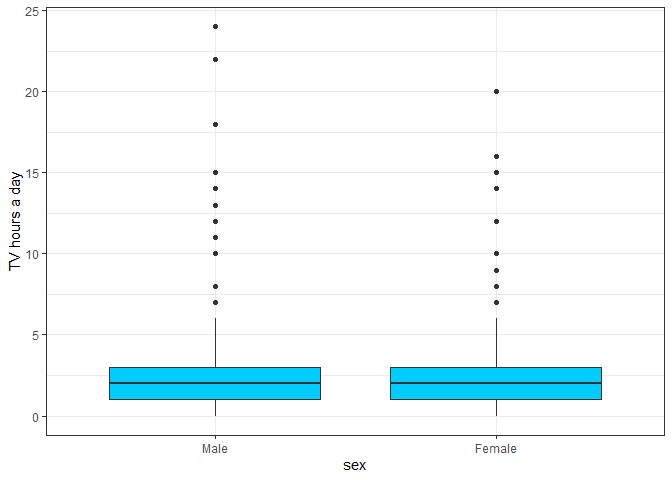
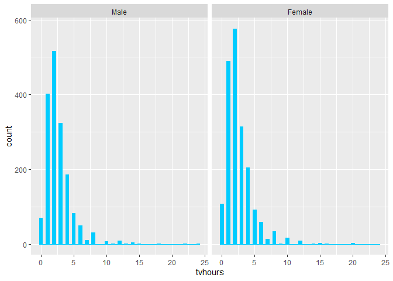
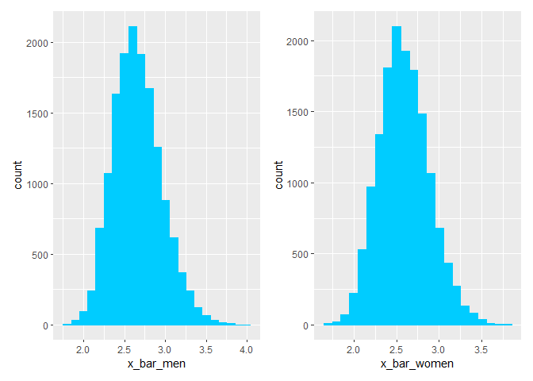
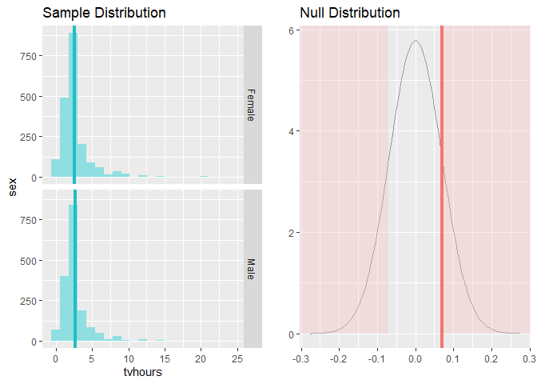
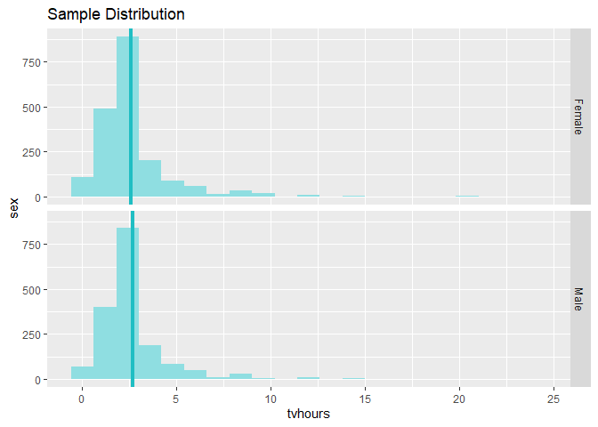

Statistical inference with the GSS data - media exposure by gender
================

## Setup

### Load packages

``` r
library(ggplot2)
library(dplyr)
library(statsr)
library(patchwork)
```

### Load data

``` r
load("gss.Rdata")
```

-----

## Part 1: Data

The data is from an observational study, the US General Social Survey,
that polls the US population using random stratified sampling method
\[source: <https://gssdataexplorer.norc.org/documents/441/display>\].

The data is generalizable only to the US population.

No causality can be established from the data, only an association
between variables.

-----

## Part 2: Research question

**On average, is there a difference in how many hours a day married men
and women watch television in the US from year 2000 to 2012?**

This question is of interest to investigate whether in the 21st century
there is a difference in media exposure for married men and women. The
assumption is that married women might have less media exposure through
TV as historically women had more household chores than men thus they
might have less time for TV. \* \* \*

## Part 3: Exploratory data analysis

-----

``` r
#filtering for NA values and year
df1 <- gss %>% 
  filter( !is.na(sex), !is.na(tvhours), year>2000, marital=='Married') 

  
  #plotting
p1<-ggplot(df1, aes(x=sex, y=tvhours)) + 
  geom_boxplot( fill = "#00CCFF") +
  labs(x = "sex", y = "TV hours a day")+
  theme_bw()
p1
```

<!-- -->

``` r
info1<-aggregate(tvhours~sex,data=df1,summary)
print(info1)
```

    ##      sex tvhours.Min. tvhours.1st Qu. tvhours.Median tvhours.Mean
    ## 1   Male     0.000000        1.000000       2.000000     2.658623
    ## 2 Female     0.000000        1.000000       2.000000     2.588756
    ##   tvhours.3rd Qu. tvhours.Max.
    ## 1        3.000000    24.000000
    ## 2        3.000000    20.000000

The boxplot and summary statistics show that men and women have the same
median and IQR of TV hours a day.

In this sample, men have on average had 0.07 more TV hours a day than
women.

## Part 4: Inference

To test whether there is a difference between the US men and women in
the average TV hours a day, we will perform hypothesis testing and
calculate confidence interval.

*Hypotheses*

\(H_0: \mu_{TV-hours-men} = \mu_{TV-hours-women}\);

\(H_A: \mu_{TV-hours-men} \ne \mu_{TV-hours-women}\)

*Checking conditions*

  - Independence:
    
      - Within groups
        
          - Random sampling is used;
        
          - Sample size for women is 1921 and men 1699, which is less
            than 10% of population of married women and men in the US
    
      - between the groups
        
          - random sampling is used

  - Sample size and skew:
    
      - The sample distribution for both men and women is right skewed
        since the minimum amount of hours a day that a person can watch
        TV is 0 and a maximum of 24. Taking into account basic human
        needs as sleeping, the maximum amount of hours decreases to
        around 18. However the sample is large enough thus the sampling
        distributions of the means is nearly normal.

<!-- end list -->

``` r
#examining sample distributions
ggplot(df1, aes(x = tvhours)) +
  geom_histogram(binwidth = .5, colour = "#00CCFF", fill = "#00CCFF") +
  facet_grid(. ~ sex)
```

<!-- -->

``` r
#examining sampling distributions of the means 
df1men<-df1 %>% 
  filter( sex=='Male')

df1women<-df1 %>% 
  filter( sex=='Female')

sample_means_women_50 <- df1women %>%
                    rep_sample_n(size = 50, reps = 15000, replace = TRUE) %>%
                    summarise(x_bar_women = mean(tvhours))

sample_means_men_50 <- df1men %>%
                    rep_sample_n(size = 50, reps = 15000, replace = TRUE) %>%
                    summarise(x_bar_men = mean(tvhours))


p2<-ggplot(data = sample_means_men_50, aes(x = x_bar_men)) +
  geom_histogram(binwidth = 0.1, colour = "#00CCFF", fill = "#00CCFF")

p3<-ggplot(data = sample_means_women_50, aes(x = x_bar_women)) +
  geom_histogram(binwidth = 0.1, colour = "#00CCFF", fill = "#00CCFF")

p2+p3
```

<!-- -->

***Hypothesis testing***

``` r
inference(y = tvhours, x = sex, data = df1, statistic = "mean", type = "ht", null = 0, 
          alternative = "twosided", method = "theoretical")
```

    ## Response variable: numerical
    ## Explanatory variable: categorical (2 levels) 
    ## n_Male = 1699, y_bar_Male = 2.6586, s_Male = 2.0715
    ## n_Female = 1921, y_bar_Female = 2.5888, s_Female = 2.0698
    ## H0: mu_Male =  mu_Female
    ## HA: mu_Male != mu_Female
    ## t = 1.0131, df = 1698
    ## p_value = 0.3111

<!-- -->

Hypothesis testing shows that p value is 0.31, which is larger than the
significance level of 0.05. Therefore we fail to reject the null
hypothesis that there is no difference between the average TV hours a
day of married US men and women in the time period 2000-2012.

***Confidence interval***

``` r
inference(y = tvhours, x = sex, data = df1, statistic = "mean", type = "ci", method = "theoretical")
```

    ## Response variable: numerical, Explanatory variable: categorical (2 levels)
    ## n_Male = 1699, y_bar_Male = 2.6586, s_Male = 2.0715
    ## n_Female = 1921, y_bar_Female = 2.5888, s_Female = 2.0698
    ## 95% CI (Male - Female): (-0.0654 , 0.2051)

<!-- -->

We are 95% confident that the difference in average TV hours a day of
married US men and women from 2000 to 2012 is between -0.0654 and 0.2051
hours.

Since 0 is in the confidence interval, we can conclude that there is no
difference between married US men and women in the average TV hours a
day from 2000 to 2012. This result agrees with the above hypothesis
testing method.
