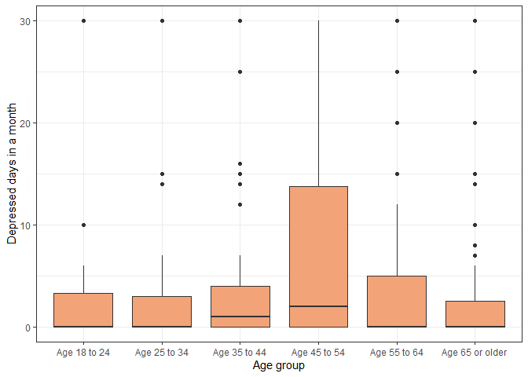
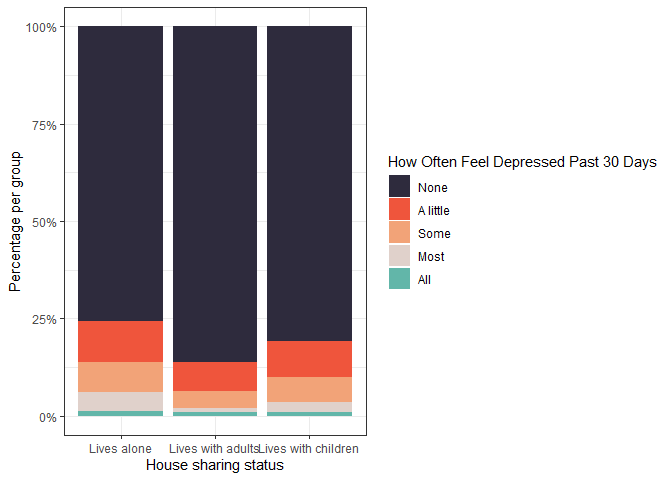
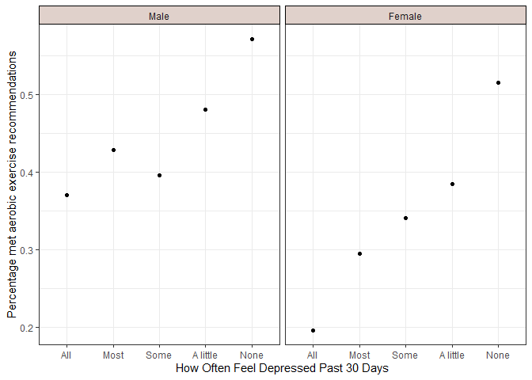

Exploring mental health data in the BRFSS dataset
================

## Setup

### Load packages

``` r
library(ggplot2)
library(dplyr)
library(patchwork)
```

### Loading data

``` r
load("brfss2013.RData")
```

-----

## Part 1: Data

The data for this task is taken from the Behavioral Risk Factor
Surveillance System project (BRFSS). The data is collected annually from
the adults living in the United States of America with stratified random
sampling method \[source:
<https://www.cdc.gov/brfss/about/brfss_faq.htm> \].

Data used in this task is from the 2013 survey.

Since the data is collected from the observational studies, it cannot
prove causality, only an association between variables.

-----

## Part 2: Research questions

**Research question 1:** Is there an association between age group of
and feeling depressed?

This question is of interest to identify the age group that needs the
most mental health support and attention.

**Research question 2:** Is there an association between an adult in the
age group ‘45-54’ living in the US alone and feeling depressed?

This question is to understand whether people feel more depressed living
alone compared to living with other people. This question is important
in the current pandemic when many cannot meet their families for
extended time.

**Research question 3:** Is there an association between physical
activity and feeling depressed for adults that live alone in the US?

This question is to understand whether exercise can be explored as a
recommendation to reduce feelings of depression.

-----

## Part 3: Exploratory data analysis

**Research question 1:** Is there an association between age group of
and feeling depressed?

``` r
#filtering for NA values
df1 <- brfss2013 %>% 
  filter( !is.na(qlmentl2), !is.na(X_age_g) )

#plotting
p1<-ggplot(df1, aes(x=X_age_g, y=qlmentl2)) + 
  geom_boxplot(fill="#F2A378") +
  labs(x = "Age group", y = "Depressed days in a month")+
  theme_bw()
p1
```

<!-- -->

The graph shows that the mean days of feeling depressed in a month are
close to 0 for age groups except age groups 35-44 and 45-54. The highest
mean days of feeling depressed in a month appears to be in the age group
45-54, which also has the highest interquartile range, indicating higher
dispersion.

The plot indicates that there might be an association between the age
group and days of feeling depressed in a month for adults residing in
the US.

**Research question 2:** Is there an association between an adult in the
age group ‘45-54’ living in the US alone and feeling depressed?

``` r
#creating new variable to identify house sharing status: living alone, living with at least one other adult and/or children, living with no other adults but with at least one child
brfss2013<-brfss2013 %>%mutate(house_sharing = ifelse(numadult == "1" & children==0,"Lives alone",
                                     ifelse(numadult == "1" & children>0,"Lives with children",
                                        ifelse(numadult !="1" & numadult !="NA", "Lives with adults", "NA"))))

#making the new variable as factor
brfss2013$house_sharing <- as.factor(brfss2013$house_sharing)

# filtering for NA values and choosing the 45-54 age-group
df2 <- brfss2013 %>%
  filter(!is.na(misdeprd),!is.na(house_sharing), X_age_g=='Age 45 to 54' )  %>% 
  group_by(house_sharing,misdeprd) %>%
  summarise(counts_misdeprd = n())%>% 
  mutate(prop_misdeprd=100*counts_misdeprd /sum(counts_misdeprd))

#plotting
p2<-ggplot(df2,aes(x = house_sharing,  y = prop_misdeprd,  fill = misdeprd)) +
  geom_bar(stat = "identity", position = position_fill(reverse = TRUE))+
  labs(x = "House sharing status", y = "Percentage per group", fill='How Often Feel Depressed Past 30 Days')+
  scale_y_continuous(labels = scales::percent_format())+
  guides(fill = guide_legend(reverse = TRUE))+
  scale_fill_manual(values = c("#62B6A9", "#E0D1CB", "#F2A378","#EF553C", "#2E2B3D" ))+
  theme_bw()

p2
```

<!-- -->

The graph shows that the US adults in age group 45-54 reported less to
not be depressed in any of the past 30 days than people living with
other adults and/or children.

There appears to be an association between house sharing status and
feeling depressed in the past 30 days for the adults residing in the US.

**Research question 3:** Is there an association between physical
activity and feeling depressed for adults that live alone in the US?

``` r
#filtering for NA values, selecting adults who live alone, calculating percentage of adults that meet aerobic recommendations
df3<-brfss2013%>%
  filter(!is.na(sex), !is.na(X_paindx1),house_sharing=='Lives alone', !is.na(misdeprd))  %>% 
  group_by(sex,misdeprd) %>% 
  summarise(perc_pa = sum(X_paindx1 == "Met aerobic recommendations") / n())

#plotting
p3<-ggplot(df3, aes(misdeprd, perc_pa)) +
  geom_point() +
  labs(x="How Often Feel Depressed Past 30 Days", y="Percentage met aerobic exercise recommendations")+
  facet_grid(. ~  sex)+
  theme_bw()+
  theme(strip.background = element_rect(colour = "black", fill = "#E0D1CB"))

p3
```

<!-- -->

There appears to be a positive association between feeling less
depressed in the past 30 days and meeting aerobic exercise
recommendations for adults in a one-person-household in the US.

This association could be interpreted as either that people in a
one-person-household feel less depressed when they exercise or people
that feel less depressed exercise more.

For females, the relationship between reported feeling of depression and
percentage of people in that group appears to be nearly linear, whereas
for men it is nearly linear from feeling depressed for ‘all’ to ‘most’
days, the relation taking a small dip at ‘some’ days and showing a
nearly linear relationship thereafter. Notably, the percentage of males
in a one-person-household in the US seems that meet aerobic exercise
recommendations is higher in all depression level self-reports.
