Baysian Statistics - Movie rating analysis
================

## Setup

### Load packages

``` r
library(ggplot2)
library(dplyr)
library(statsr)
library(BAS)
library(GGally)
library(tidyr)
library(BAS)
library(broom)
```

### Load data

``` r
load("movies.Rdata")
```

-----

## Part 1: Data

The data comprises of 651 randomly selected movies from 1970 to 2016 and
their 32 descriptive variables such as release year, best picture
nomination, movie score on Rotten Tomatoes and IMDB etc.

Since the data collection method is an observation and not a random
assignment experiment, no causality can be established.

The conclusions can only be generalizable to the population that the
random sample was selected from, that is, movies released from 1970 to
2016. \* \* \*

## Part 2: Data manipulation

``` r
movies <-movies %>%
  mutate(feature_film = case_when(title_type == 'Feature Film' ~ 'yes', 
                         title_type!= 'Feature Film' & title_type!='NA' ~ 'no', 
                         TRUE ~  'NA')) %>%
  mutate(feature_film = as.factor(feature_film))

movies <-movies %>%
  mutate(drama = case_when(genre == 'Drama' ~ 'yes', 
                         genre!= 'Drama' & genre!='NA' ~ 'no', 
                         TRUE ~  'NA')) %>%
  mutate(drama = as.factor(drama))

movies <-movies %>%
  mutate(mpaa_rating_R = case_when(mpaa_rating == 'R' ~ 'yes', 
                         mpaa_rating!= 'R'& mpaa_rating!='NA' ~ 'no',
                         TRUE ~  'NA')) %>%
  mutate(mpaa_rating_R = as.factor(mpaa_rating_R))

movies <-movies %>%
  mutate(oscar_season = case_when(thtr_rel_month == 10 |thtr_rel_month == 11 |
                          thtr_rel_month == 12 ~ 'yes', 
                         (thtr_rel_month!= 10|thtr_rel_month!= 11|thtr_rel_month!= 12)
                         & thtr_rel_month!='NA' ~ 'no', 
                         TRUE ~  'NA'))  %>%
  mutate(oscar_season = as.factor(oscar_season))

movies <-movies %>%
  mutate(summer_season = case_when(thtr_rel_month == 5|thtr_rel_month == 6 
                          |thtr_rel_month == 7 | thtr_rel_month == 8 ~ 'yes',
                          (thtr_rel_month!= 5|thtr_rel_month!= 6|
                          thtr_rel_month!= 7|thtr_rel_month!= 8)
                         & thtr_rel_month!='NA' ~ 'no', 
                         TRUE ~  'NA')) %>%
  mutate(summer_season = as.factor(summer_season))
```

-----

## Part 3: Exploratory data analysis

``` r
movies_long<- movies %>%
pivot_longer(33:37, names_to = "variable", values_to = "Yes_or_No")

ggplot(movies_long, aes(x=variable, y=audience_score, fill=Yes_or_No))+
  geom_boxplot()+ 
  scale_fill_manual(values=c("#E0D1CB", "#F2A378")) +
  theme_bw()
```

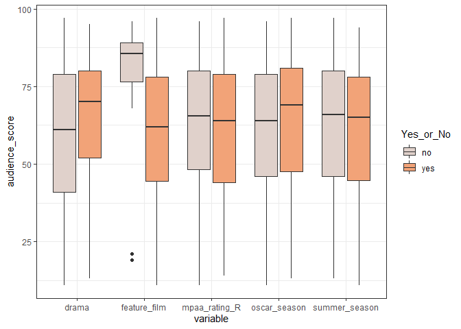<!-- -->

``` r
movies_long_subset<-movies_long[c(18,33:34)]
tapply(movies_long_subset$audience_score, list(movies_long_subset$variable, movies_long_subset$Yes_or_No), mean) 
```

    ##                     no      yes
    ## drama         59.73121 65.34754
    ## feature_film  81.05000 60.46531
    ## mpaa_rating_R 62.68944 62.04255
    ## oscar_season  61.81304 63.68586
    ## summer_season 62.62302 61.80769

``` r
summary(movies[33:37])
```

    ##  feature_film drama     mpaa_rating_R oscar_season summer_season
    ##  no : 60      no :346   no :322       no :460      no :443      
    ##  yes:591      yes:305   yes:329       yes:191      yes:208

Boxplots below show the relationship between audience\_score and newly
constructed variables.In addition, a summary statistic of mean value of
categories ‘yes’ or ‘no’ for new variables shows us whether on average
‘yes’ or ‘no’ influences the audience score.

  - For drama variable, we see on average a higher audience score if
    movie is type ‘drama’.

  - In feature\_film variable we see the most noticeable difference in
    audience score depending on whether the movie is feature film or
    not, where non feature films have on average a much higher score
    than feature films with less variability. However, as seen from he
    summary statistics of the new variables, in this sample we have
    almost 10 times more observations of non feature films than the
    feature films which might have contributed to the variability and
    the observed differences in the mean and median audience score.

  - In MPPA\_rating\_R, oscar\_season and summer\_season variables the
    difference between the mean and median audience score is small, with
    variables having comparable variance.

-----

## Part 4: Modeling

First, we select the variables of our choice and remove rows with NA
values in any of the given rows.

``` r
movies_select<-movies[,c('audience_score','feature_film','drama', 'runtime', 'mpaa_rating_R', 'thtr_rel_year', 'oscar_season', 'summer_season', 'imdb_rating', 'imdb_num_votes', 'critics_score', 'best_pic_nom', 'best_pic_win', 'best_actor_win', 'best_actress_win', 'best_dir_win', 'top200_box')]
movies_select=na.omit(movies_select)
```

Plotting a histogram of audience\_score reveals a left-tailed
distribution of scores with two peaks.

``` r
ggplot(movies_select, aes(x=audience_score)) + 
 geom_histogram(aes(y=..density..), colour="#E0D1CB", fill="#F2A378")+
 geom_density(alpha=.2, fill="#2E2B3D") +
  theme_bw()
```

    ## `stat_bin()` using `bins = 30`. Pick better value with `binwidth`.

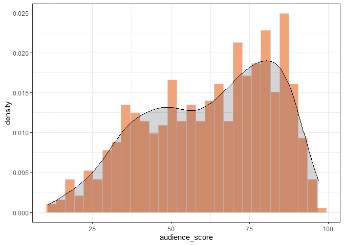<!-- -->
To normalize the audience score distribution, we introduce a squared
audience score variable saudience\_score.

``` r
movies_select$saudience_score = (movies_select$audience_score)^2
```

s\_audience score histogram shows a more uniform distribution, still
exhibiting two peaks, however less apparent.

``` r
ggplot(movies_select, aes(x=saudience_score)) + 
 geom_histogram(aes(y=..density..), colour="#E0D1CB", fill="#F2A378")+
 geom_density(alpha=.2, fill="#2E2B3D") +
  theme_bw()
```

    ## `stat_bin()` using `bins = 30`. Pick better value with `binwidth`.

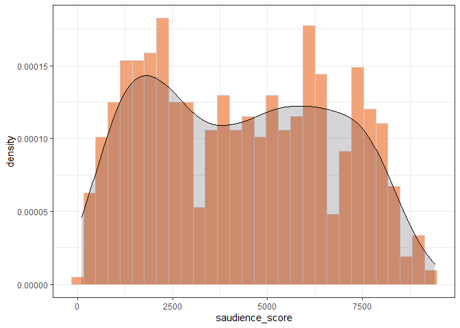<!-- -->

Examining the correlation between the numerical variables in our
prediction model, we notice that imdb\_rating and critics\_score are
highly correlated.

``` r
ggpairs(movies_select[,c('audience_score', 'runtime',  'thtr_rel_year', 'imdb_rating', 'imdb_num_votes', 'critics_score')])
```

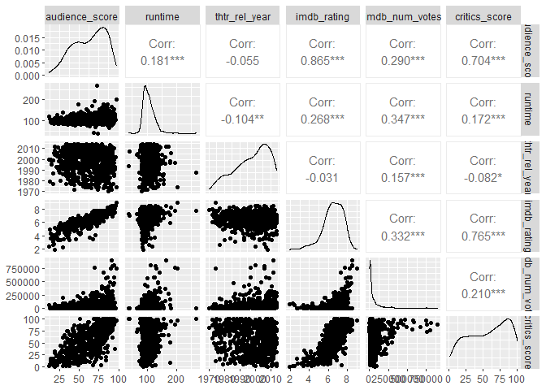<!-- -->

Therefore including both of these variables in one model is not
desirable and further we will create two Baysian multiple regression
models, one including imdb\_rating (movies.ZS\_ir) and one including
critics\_score (movies.ZS\_cs).

``` r
movies.ZS_ir =  bas.lm(saudience_score ~ .-audience_score-saudience_score-critics_score, data=movies_select,
                   prior="ZS-null", modelprior=uniform(), method = "MCMC") 
movies.ZS_cs =  bas.lm(saudience_score ~ .-audience_score-imdb_rating, data=movies_select,
                   prior="ZS-null", modelprior=uniform(), method = "MCMC")  

summary(movies.ZS_ir)
```

    ##                     P(B != 0 | Y)  model 1     model 2     model 3     model 4
    ## Intercept              1.00000000   1.0000   1.0000000   1.0000000   1.0000000
    ## feature_filmyes        0.98265686   1.0000   1.0000000   1.0000000   1.0000000
    ## dramayes               0.14088440   0.0000   0.0000000   0.0000000   1.0000000
    ## runtime                0.80267181   1.0000   1.0000000   1.0000000   1.0000000
    ## mpaa_rating_Ryes       0.10600433   0.0000   0.0000000   0.0000000   0.0000000
    ## thtr_rel_year          0.75730133   1.0000   1.0000000   1.0000000   1.0000000
    ## oscar_seasonyes        0.07999420   0.0000   0.0000000   0.0000000   0.0000000
    ## summer_seasonyes       0.11565094   0.0000   0.0000000   0.0000000   0.0000000
    ## imdb_rating            0.99998932   1.0000   1.0000000   1.0000000   1.0000000
    ## imdb_num_votes         0.79378204   1.0000   1.0000000   1.0000000   1.0000000
    ## best_pic_nomyes        0.76296082   1.0000   0.0000000   1.0000000   1.0000000
    ## best_pic_winyes        0.07040253   0.0000   0.0000000   0.0000000   0.0000000
    ## best_actor_winyes      0.13715973   0.0000   0.0000000   0.0000000   0.0000000
    ## best_actress_winyes    0.21294861   0.0000   0.0000000   1.0000000   0.0000000
    ## best_dir_winyes        0.06144867   0.0000   0.0000000   0.0000000   0.0000000
    ## top200_boxyes          0.06028442   0.0000   0.0000000   0.0000000   0.0000000
    ## BF                             NA   1.0000   0.4458984   0.2735035   0.1826639
    ## PostProbs                      NA   0.1503   0.0687000   0.0407000   0.0272000
    ## R2                             NA   0.7381   0.7350000   0.7395000   0.7391000
    ## dim                            NA   7.0000   6.0000000   8.0000000   8.0000000
    ## logmarg                        NA 413.1193 412.3116144 411.8228377 411.4191712
    ##                         model 5
    ## Intercept             1.0000000
    ## feature_filmyes       1.0000000
    ## dramayes              0.0000000
    ## runtime               1.0000000
    ## mpaa_rating_Ryes      0.0000000
    ## thtr_rel_year         0.0000000
    ## oscar_seasonyes       0.0000000
    ## summer_seasonyes      0.0000000
    ## imdb_rating           1.0000000
    ## imdb_num_votes        1.0000000
    ## best_pic_nomyes       1.0000000
    ## best_pic_winyes       0.0000000
    ## best_actor_winyes     0.0000000
    ## best_actress_winyes   0.0000000
    ## best_dir_winyes       0.0000000
    ## top200_boxyes         0.0000000
    ## BF                    0.1710233
    ## PostProbs             0.0253000
    ## R2                    0.7342000
    ## dim                   6.0000000
    ## logmarg             411.3533232

``` r
summary(movies.ZS_cs)
```

    ##                     P(B != 0 | Y)  model 1     model 2     model 3     model 4
    ## Intercept              1.00000000   1.0000   1.0000000   1.0000000   1.0000000
    ## feature_filmyes        0.99997101   1.0000   1.0000000   1.0000000   1.0000000
    ## dramayes               0.71029968   1.0000   1.0000000   1.0000000   0.0000000
    ## runtime                0.06661377   0.0000   0.0000000   0.0000000   0.0000000
    ## mpaa_rating_Ryes       0.06325684   0.0000   0.0000000   0.0000000   0.0000000
    ## thtr_rel_year          0.68039551   1.0000   1.0000000   0.0000000   1.0000000
    ## oscar_seasonyes        0.06539764   0.0000   0.0000000   0.0000000   0.0000000
    ## summer_seasonyes       0.07177429   0.0000   0.0000000   0.0000000   0.0000000
    ## imdb_num_votes         0.99994354   1.0000   1.0000000   1.0000000   1.0000000
    ## critics_score          0.99989777   1.0000   1.0000000   1.0000000   1.0000000
    ## best_pic_nomyes        0.43879242   0.0000   1.0000000   0.0000000   0.0000000
    ## best_pic_winyes        0.12379761   0.0000   0.0000000   0.0000000   0.0000000
    ## best_actor_winyes      0.08810272   0.0000   0.0000000   0.0000000   0.0000000
    ## best_actress_winyes    0.17034760   0.0000   0.0000000   0.0000000   0.0000000
    ## best_dir_winyes        0.07573090   0.0000   0.0000000   0.0000000   0.0000000
    ## top200_boxyes          0.07801514   0.0000   0.0000000   0.0000000   0.0000000
    ## BF                             NA   1.0000   0.4685497   0.4052706   0.3391961
    ## PostProbs                      NA   0.1408   0.0660000   0.0568000   0.0479000
    ## R2                             NA   0.5496   0.5524000   0.5444000   0.5441000
    ## dim                            NA   6.0000   7.0000000   5.0000000   5.0000000
    ## logmarg                        NA 241.8014 241.0432951 240.8982079 240.7202314
    ##                         model 5
    ## Intercept             1.0000000
    ## feature_filmyes       1.0000000
    ## dramayes              1.0000000
    ## runtime               0.0000000
    ## mpaa_rating_Ryes      0.0000000
    ## thtr_rel_year         0.0000000
    ## oscar_seasonyes       0.0000000
    ## summer_seasonyes      0.0000000
    ## imdb_num_votes        1.0000000
    ## critics_score         1.0000000
    ## best_pic_nomyes       1.0000000
    ## best_pic_winyes       0.0000000
    ## best_actor_winyes     0.0000000
    ## best_actress_winyes   0.0000000
    ## best_dir_winyes       0.0000000
    ## top200_boxyes         0.0000000
    ## BF                    0.2695144
    ## PostProbs             0.0370000
    ## R2                    0.5478000
    ## dim                   6.0000000
    ## logmarg             240.4902748

**Diagnostics**

##### Residuals Versus Fitted Values Using BMA

The plots below show the residuals over the fitted value under Bayesian
model averaging results for both models movies.ZS\_cs and movies.ZS\_ir.

  - For movies.ZS\_cs model the residuals are mostly randomly scattered
    around o indicating a constant variance.

  - For movies.ZS\_cs model we see that the residuals are not randomly
    scattered around 0 showing a V shaped relationship.

Considering the non normal residuals of movies.ZS\_cs model and the fact
that we have no information of whether audience\_score and imdb\_rating
are independent, that is, whether people who voted on Rotten Tomatoes
website (thus influencing the audience score variable) also did not vote
on the IMDB website contributing to that rating as well, we decide to
dismiss the model containing imdb\_rating variable and proceed with
movies.ZS\_cs model.

``` r
plot(movies.ZS_cs, which = 1, add.smooth = F, 
     ask = F, pch = 16, sub.caption="", caption="")
abline(a = 0, b = 0, col = "darkgrey", lwd = 2) 
```

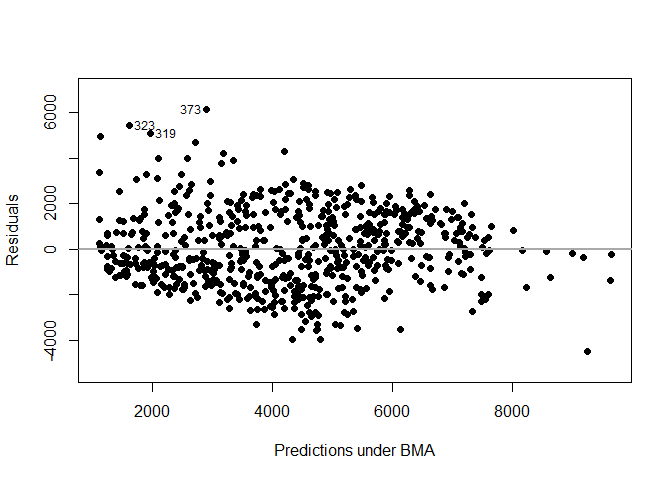<!-- -->

``` r
plot(movies.ZS_ir, which = 1, add.smooth = F, 
     ask = F, pch = 16, sub.caption="", caption="")
abline(a = 0, b = 0, col = "darkgrey", lwd = 2)
```

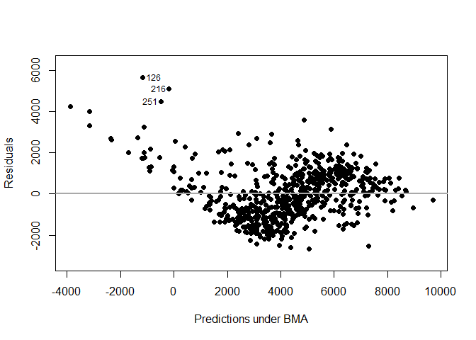<!-- -->

##### Residuals Versus Fitted Values Using BMA

The diagnostic plot shows that all points are on the 45 degree diagonal
line meaning that the posterior inclusion probability of each variable
from MCMC have converged to the theoretical posterior inclusion
probability.

``` r
diagnostics(movies.ZS_cs, type="pip", col = "blue", pch = 16, cex = 1.5)
```

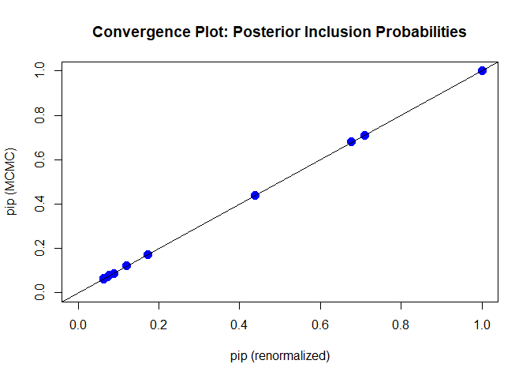<!-- -->

The model posterior probability plot also shows that all points are on
the diagonal line suggesting that we have enough MCMC iterations.

``` r
diagnostics(movies.ZS_cs, type = "model", col = "blue", pch = 16, cex = 1.5)
```

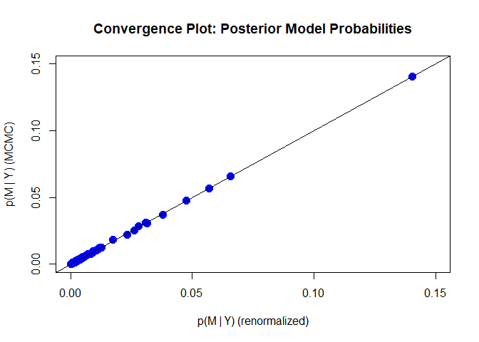<!-- -->

##### Cumulative Sampled Probability

The cumulative sampled model probability plot shows that at 500 models
the probability is leveling off and additional models are not
contributing to the posterior distribution.

``` r
plot(movies.ZS_cs, which=2, add.smooth = F, sub.caption="", caption="")
```

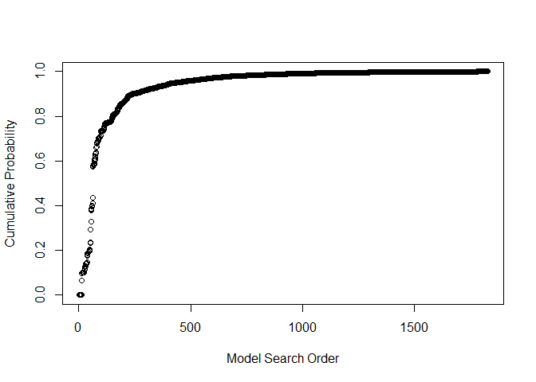<!-- -->

##### Model Complexity

The model size versus the natural logarithm of the marginal likelihood
plot shows that models with 6 to 8 predictors have the highest marginal
likelihoods.

``` r
plot(movies.ZS_cs, which=3, ask=F, caption="", sub.caption="")
```

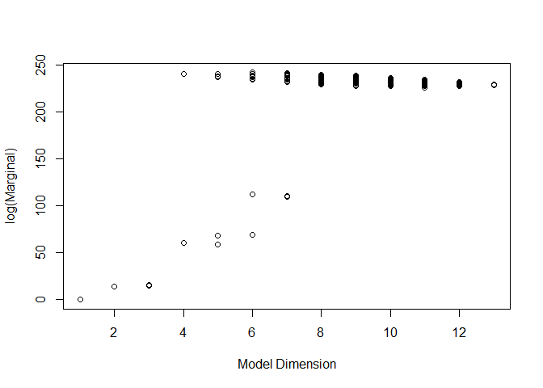<!-- -->

##### Model Space Visualization

Model Space Visualization shows that the top 3 models all include
feature\_film, drama, imdb\_num\_votes and critics\_score variables.

``` r
image(movies.ZS_cs, rotate = F)
```

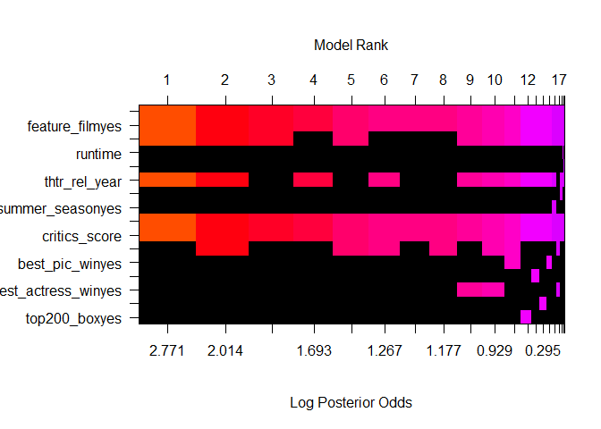<!-- -->

##### Marginal Inclusion Probability

Additionally, marginal inclusion probability plot shows that
thtr\_rel\_year is also an important predictor variable.

``` r
plot(movies.ZS_cs, which = 4, ask = F, caption = "", sub.caption = "", 
     col.in = "blue", col.ex = "darkgrey", lwd = 3)
```

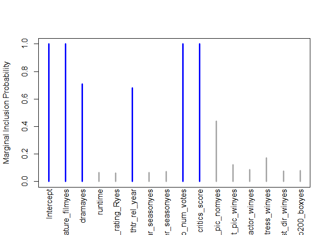<!-- -->
he lines in blue correspond to the variables where the marginal
posterior inclusion probability (pip), is greater than 0.5, suggesting
that these variables are important for prediction. The variables
represented in grey lines have posterior inclusion probability less than
0.5. Small posterior inclusion probability may arise when two or more
variables are highly correlated, similar to large  
p -values with multicollinearity. So we should be cautious to use these
posterior inclusion probabilities to eliminate variables.

-----

## Part 5: Prediction

To predict the IMDB score of the movie “The Accountant” (2016)
\[<https://www.imdb.com/title/tt2140479/?ref_=fn_ft_tt_19>;
<https://www.rottentomatoes.com/m/the_accountant_2016>\], we need to
create a database of the variables needed for the model and then use the
`predict` function to predict its rating using the Best Predictive
Model.

``` r
Accountant<-data.frame(imdb_num_votes=269454 , drama='yes' , critics_score=52, feature_film='yes',
     mpaa_rating_R='yes' , thtr_rel_year=2016, oscar_season='yes')
```

``` r
BPM_pred_movies.ZS_cs <- predict(movies.ZS_cs, estimator = "BPM", se.fit = TRUE)
variable.names(BPM_pred_movies.ZS_cs)
```

    ## [1] "Intercept"        "feature_filmyes"  "dramayes"         "mpaa_rating_Ryes"
    ## [5] "thtr_rel_year"    "oscar_seasonyes"  "imdb_num_votes"   "critics_score"

We see that Best predictive model includes the following variables:
feature\_film, drama, mpaa\_rating\_R, thtr\_rel\_year, oscar\_season,
imdb\_num\_votes, critics\_score. Now we create a model based on these
variables.

``` r
movies.ZS_cs_final =  bas.lm(saudience_score ~ feature_film+drama+mpaa_rating_R+thtr_rel_year+oscar_season+imdb_num_votes+ critics_score   , data=movies_select,
                   prior="ZS-null", modelprior=uniform(), method = "MCMC")
```

To calculate the predicted audiece score, we first need to take the
squareroot of the fit because it was based on the saudience\_score
variable.

``` r
predicition_Accountant<-predict(movies.ZS_cs_final, Accountant, estimator='BPM', se.fit = TRUE)
predicted_audience_score=sqrt(predicition_Accountant$fit)
predicted_audience_score
```

    ## [1] 69.58509
    ## attr(,"model")
    ## [1] 0 1 3 6 7
    ## attr(,"best")
    ## [1] 18
    ## attr(,"estimator")
    ## [1] "BPM"

We also calculate the confidence interval of the audience score:

``` r
movies.BPM.conf.fit = confint(predicition_Accountant, parm = "mean")

sqrt(cbind(predicition_Accountant$fit,movies.BPM.conf.fit))
```

    ##                   2.5%    97.5%     mean
    ## [1,] 69.58509 67.36509 71.73642 69.58509

The predicted audience score of the movie ‘Accountant’ is 69.6 with the
confidence interval from 67.5 to 72.5. The actual audience score of the
movie is 76. The actual score does not lie within the confidence
interval however it is close to its upper bound. This indicates that the
model would need to be improved to precisely predict audience score of
movies.

-----

## Part 6: Conclusion

The above analysis created a Bayesian Averaging Model to predict the
audience score based on several variables. We used Best Predictive Model
to estimate audience score of a selected movie. The Best Predictive
Model did not deliver a precise prediction within the 95% confidence
interval.

This shows that the model can be improved. We could do an experiment
incited of observational study, where we control for the selected movies
and amount of reviews. Usually people who go on websites to rate movies
are either highly satisfied or highly dissatisfied which
inflates/deflates the rating making the model less precise.
