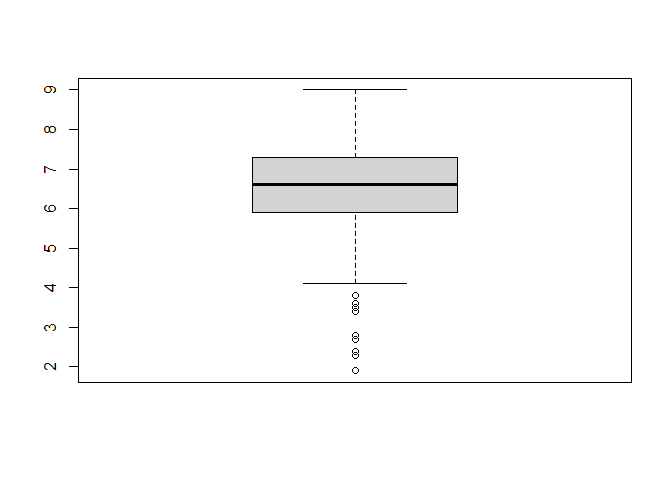
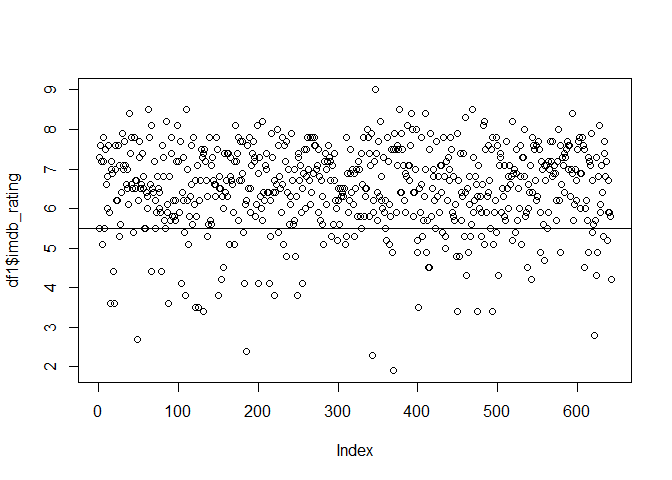
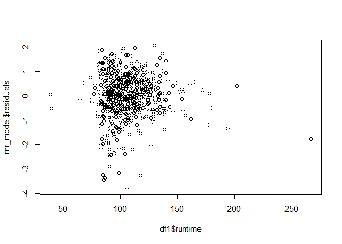
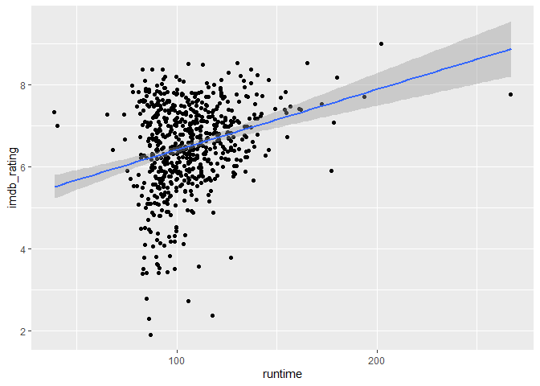
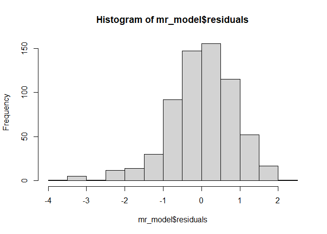
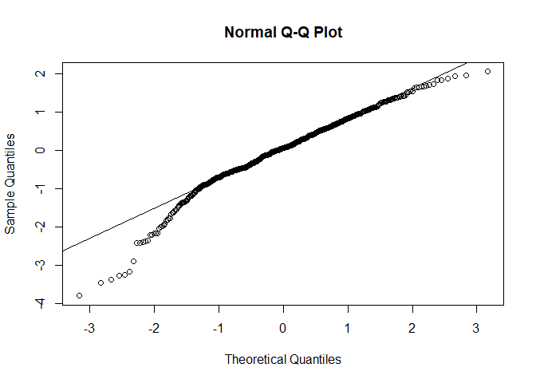
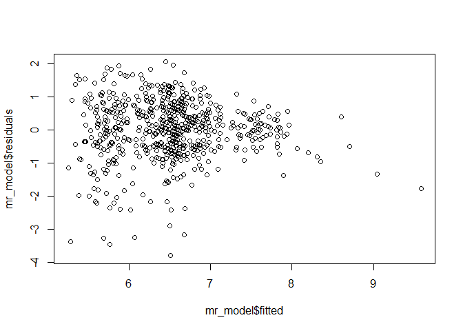
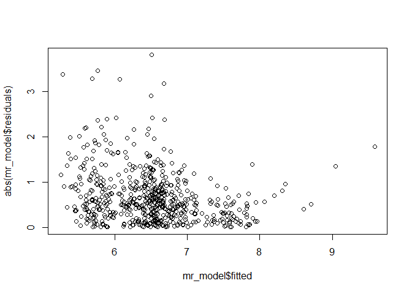
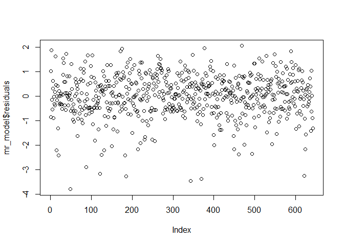

Linear Regression Modeling and rating prediction for movies
================

## Setup

### Load packages

``` r
library(ggplot2)
library(dplyr)
library(statsr)
library(tidyr)
library(GGally)
library(patchwork)
library(olsrr)
```

### Load data

``` r
load("movies.Rdata")
```

-----

## Part 1: Data

The data comprises of 651 randomly selected movies from 1970 to 2016 and
their 32 descriptive variables such as release year, best picture
nomination, movie score on Rotten Tomatoes and IMDB etc.

Since the data collection method is an observation, no causality can be
established. From our analysis we will only be able to show association
between variables.

The conclusions can only be generalisable to the sample population, that
is, movies released from 1970 to 2016

-----

## Part 2: Research question

\*\* Which variables are associated with the IMDB score of a movie? \*\*

We want to investigate which variables are important to consider when
making a new movie, to ensure higher popularity of a movie.

-----

## Part 3: Exploratory data analysis

Firstly, we pick the variables to be used in the further analysis.

Want to predict: “imdb\_rating”

  - Included:
      - categorical: “best\_actor\_win”,
        “best\_actress\_win”,“best\_dir\_win”,“top200\_box”,
        “genre”, “best\_pic\_nom”, “best\_pic\_win”, “thtr\_rel\_day”,
        “thtr\_rel\_month”, “dvd\_rel\_month”, “dvd\_rel\_day”,
        “title\_type”, “mpaa\_rating”
    
      - numerical: “runtime”
  - Not included:
      - “title”: could be explored if certain words in the title are
        associated with viewer score however too complicated
      - “imdb\_url”,“rt\_url”: irrelevant
      - “director”,“actor1”, “actor2” ,“actor3”, “actor4”,“actor5”:
        included in other variable, for example, “best\_dir\_win”,
      - “dvd\_rel\_year”, “thtr\_rel\_year”, “imdb\_num\_votes” : we
        want to explore what influences popularity of the movies to
        predict it for future movies. Year or nr of votes is not a
        variable we can influence for future movies.
      - “critics\_rating”,“critics\_score”,
        “audience\_rating”,“audience\_score” : these variables are
        from ‘Rotten Tomatoes’. It is possible that there are people who
        voted on both sited, thus for independence of variables, we
        exclude these.  
      - “studio” - too many levels

Next, we select the chosen variables and exclude rows that have NA
values.

``` r
df1<- select(movies, imdb_rating,best_actor_win, best_actress_win,best_dir_win,top200_box, genre, runtime , best_pic_nom, best_pic_win,  thtr_rel_day, thtr_rel_month, dvd_rel_month,   dvd_rel_day, title_type, mpaa_rating)%>% 
  drop_na()
```

Now can we will explore our variable of interest, the IMDB rating of a
movie.

``` r
boxplot(df1$imdb_rating)
```

<!-- -->

``` r
summary(df1$imdb_rating)
```

    ##    Min. 1st Qu.  Median    Mean 3rd Qu.    Max. 
    ##     1.9     5.9     6.6     6.5     7.3     9.0

From the box-plot and the summary, we can see that the distribution of
IMDB ratings is left skewed with a median of 6.6. 50% of the data is
between 5.9 and 7.3, which is a range of only 1.4 rating points.

Since the IMDB rating are given from 1 to 10, in a normal distribution,
we would expect the mean to be around 5.5.

``` r
plot(df1$imdb_rating)+abline(h=5.5)
```

<!-- -->

    ## integer(0)

``` r
lesseq55=sum(df1$imdb_rating <= 5.5)
perc_lesseq55=lesseq55*100/nrow(df1)
perc_lesseq55=format(round(perc_lesseq55, 0), nsmall = 0)
paste("Nr of observations with IMDB score equal or less than 5.5: ", lesseq55)
```

    ## [1] "Nr of observations with IMDB score equal or less than 5.5:  99"

``` r
paste("Percentage of observations with IMDB score equal or less than 5.5:", perc_lesseq55, "%")
```

    ## [1] "Percentage of observations with IMDB score equal or less than 5.5: 15 %"

However as seen from the plot and summary variables, only 15% of the
ratings are below 5.5 score, and the majority (75%) is above 5.5 rating.
\* \* \*

## Part 4: Modeling

Develop a multiple linear regression model to predict a numerical
variable in the dataset. The response variable and the explanatory
variables can be existing variables in the dataset, or new variables you
create based on existing variables.

To search for variables that are associated with the IMDB score of a
movie, we apply a full linear model consisting of all chosen variables.

``` r
full_model<-lm(imdb_rating~best_actor_win+ best_actress_win+best_dir_win+top200_box+genre+runtime+best_pic_nom+best_pic_win+thtr_rel_day+thtr_rel_month+dvd_rel_month+dvd_rel_day+title_type+ mpaa_rating,data=df1)
summary(full_model)
```

    ## 
    ## Call:
    ## lm(formula = imdb_rating ~ best_actor_win + best_actress_win + 
    ##     best_dir_win + top200_box + genre + runtime + best_pic_nom + 
    ##     best_pic_win + thtr_rel_day + thtr_rel_month + dvd_rel_month + 
    ##     dvd_rel_day + title_type + mpaa_rating, data = df1)
    ## 
    ## Residuals:
    ##     Min      1Q  Median      3Q     Max 
    ## -3.8047 -0.4934  0.0495  0.5814  2.0267 
    ## 
    ## Coefficients:
    ##                                  Estimate Std. Error t value Pr(>|t|)    
    ## (Intercept)                     6.0433439  0.4666128  12.952  < 2e-16 ***
    ## best_actor_winyes              -0.0219614  0.1068950  -0.205 0.837290    
    ## best_actress_winyes            -0.0050076  0.1178150  -0.043 0.966111    
    ## best_dir_winyes                 0.3667016  0.1534387   2.390 0.017154 *  
    ## top200_boxyes                   0.5340969  0.2423482   2.204 0.027906 *  
    ## genreAnimation                 -0.1936538  0.3525244  -0.549 0.582976    
    ## genreArt House & International  0.7535484  0.2800195   2.691 0.007317 ** 
    ## genreComedy                    -0.0794795  0.1517236  -0.524 0.600576    
    ## genreDocumentary                0.8829308  0.3564386   2.477 0.013514 *  
    ## genreDrama                      0.6196016  0.1297713   4.775 2.25e-06 ***
    ## genreHorror                    -0.1344062  0.2237343  -0.601 0.548235    
    ## genreMusical & Performing Arts  0.9538250  0.3044603   3.133 0.001814 ** 
    ## genreMystery & Suspense         0.4146882  0.1683484   2.463 0.014041 *  
    ## genreOther                      0.5360697  0.2552048   2.101 0.036089 *  
    ## genreScience Fiction & Fantasy -0.0077084  0.3366326  -0.023 0.981739    
    ## runtime                         0.0102611  0.0021760   4.716 2.99e-06 ***
    ## best_pic_nomyes                 0.8676379  0.2314370   3.749 0.000194 ***
    ## best_pic_winyes                 0.0010555  0.4089365   0.003 0.997941    
    ## thtr_rel_day                    0.0028556  0.0040631   0.703 0.482444    
    ## thtr_rel_month                  0.0028628  0.0106092   0.270 0.787372    
    ## dvd_rel_month                   0.0234279  0.0107757   2.174 0.030077 *  
    ## dvd_rel_day                    -0.0005362  0.0040166  -0.134 0.893834    
    ## title_typeFeature Film         -0.8234278  0.3307672  -2.489 0.013058 *  
    ## title_typeTV Movie             -1.4145589  0.5211606  -2.714 0.006830 ** 
    ## mpaa_ratingNC-17               -0.4164962  0.6816795  -0.611 0.541436    
    ## mpaa_ratingPG                  -0.5859033  0.2536528  -2.310 0.021227 *  
    ## mpaa_ratingPG-13               -0.8219940  0.2596416  -3.166 0.001623 ** 
    ## mpaa_ratingR                   -0.5027847  0.2523186  -1.993 0.046742 *  
    ## mpaa_ratingUnrated             -0.3711859  0.2925345  -1.269 0.204972    
    ## ---
    ## Signif. codes:  0 '***' 0.001 '**' 0.01 '*' 0.05 '.' 0.1 ' ' 1
    ## 
    ## Residual standard error: 0.891 on 613 degrees of freedom
    ## Multiple R-squared:  0.3424, Adjusted R-squared:  0.3123 
    ## F-statistic:  11.4 on 28 and 613 DF,  p-value: < 2.2e-16

To determine the best model for IMDB rating prediction, we will use
backward selection p-value method. Here we drop the variable with the
highest p-value and refit the model using `ols_step_backward_p()`
function from the olsrr library. The steps are repeat until all
remaining variables are significant, that is, until Pr(\>|t|) is smaller
than 0.05 for at least one of the factors of the variable.

``` r
ols_step_backward_p(full_model, details = TRUE)
```

    ## Backward Elimination Method 
    ## ---------------------------
    ## 
    ## Candidate Terms: 
    ## 
    ## 1 . best_actor_win 
    ## 2 . best_actress_win 
    ## 3 . best_dir_win 
    ## 4 . top200_box 
    ## 5 . genre 
    ## 6 . runtime 
    ## 7 . best_pic_nom 
    ## 8 . best_pic_win 
    ## 9 . thtr_rel_day 
    ## 10 . thtr_rel_month 
    ## 11 . dvd_rel_month 
    ## 12 . dvd_rel_day 
    ## 13 . title_type 
    ## 14 . mpaa_rating 
    ## 
    ## We are eliminating variables based on p value...
    ## 
    ## - best_pic_win 
    ## 
    ## Backward Elimination: Step 1 
    ## 
    ##  Variable best_pic_win Removed 
    ## 
    ##                         Model Summary                          
    ## --------------------------------------------------------------
    ## R                       0.585       RMSE                0.890 
    ## R-Squared               0.342       Coef. Var          13.697 
    ## Adj. R-Squared          0.313       MSE                 0.793 
    ## Pred R-Squared          0.271       MAE                 0.656 
    ## --------------------------------------------------------------
    ##  RMSE: Root Mean Square Error 
    ##  MSE: Mean Square Error 
    ##  MAE: Mean Absolute Error 
    ## 
    ##                                ANOVA                                 
    ## --------------------------------------------------------------------
    ##                Sum of                                               
    ##               Squares         DF    Mean Square      F         Sig. 
    ## --------------------------------------------------------------------
    ## Regression    253.352         27          9.383    11.839    0.0000 
    ## Residual      486.638        614          0.793                     
    ## Total         739.990        641                                    
    ## --------------------------------------------------------------------
    ## 
    ##                                             Parameter Estimates                                             
    ## -----------------------------------------------------------------------------------------------------------
    ##                          model      Beta    Std. Error    Std. Beta      t        Sig      lower     upper 
    ## -----------------------------------------------------------------------------------------------------------
    ##                    (Intercept)     6.043         0.466                 12.965    0.000     5.128     6.959 
    ##              best_actor_winyes    -0.022         0.106       -0.007    -0.207    0.836    -0.231     0.187 
    ##            best_actress_winyes    -0.005         0.118       -0.001    -0.042    0.966    -0.236     0.226 
    ##                best_dir_winyes     0.367         0.147        0.085     2.494    0.013     0.078     0.656 
    ##                  top200_boxyes     0.534         0.242        0.075     2.208    0.028     0.059     1.009 
    ##                 genreAnimation    -0.194         0.352       -0.021    -0.550    0.583    -0.885     0.498 
    ## genreArt House & International     0.754         0.280        0.099     2.693    0.007     0.204     1.303 
    ##                    genreComedy    -0.079         0.151       -0.025    -0.525    0.600    -0.377     0.218 
    ##               genreDocumentary     0.883         0.356        0.218     2.479    0.013     0.184     1.582 
    ##                     genreDrama     0.620         0.130        0.288     4.779    0.000     0.365     0.874 
    ##                    genreHorror    -0.134         0.224       -0.023    -0.601    0.548    -0.573     0.305 
    ## genreMusical & Performing Arts     0.954         0.304        0.120     3.136    0.002     0.356     1.551 
    ##        genreMystery & Suspense     0.415         0.168        0.112     2.465    0.014     0.084     0.745 
    ##                     genreOther     0.536         0.255        0.078     2.106    0.036     0.036     1.036 
    ## genreScience Fiction & Fantasy    -0.008         0.336       -0.001    -0.023    0.982    -0.668     0.653 
    ##                        runtime     0.010         0.002        0.186     4.729    0.000     0.006     0.015 
    ##                best_pic_nomyes     0.868         0.208        0.147     4.182    0.000     0.460     1.275 
    ##                   thtr_rel_day     0.003         0.004        0.024     0.704    0.482    -0.005     0.011 
    ##                 thtr_rel_month     0.003         0.011        0.009     0.271    0.787    -0.018     0.024 
    ##                  dvd_rel_month     0.023         0.011        0.074     2.180    0.030     0.002     0.045 
    ##                    dvd_rel_day    -0.001         0.004       -0.004    -0.134    0.894    -0.008     0.007 
    ##         title_typeFeature Film    -0.823         0.330       -0.218    -2.491    0.013    -1.472    -0.174 
    ##             title_typeTV Movie    -1.415         0.521       -0.116    -2.717    0.007    -2.437    -0.392 
    ##               mpaa_ratingNC-17    -0.416         0.681       -0.022    -0.611    0.541    -1.754     0.921 
    ##                  mpaa_ratingPG    -0.586         0.253       -0.209    -2.312    0.021    -1.084    -0.088 
    ##               mpaa_ratingPG-13    -0.822         0.259       -0.309    -3.169    0.002    -1.331    -0.313 
    ##                   mpaa_ratingR    -0.503         0.252       -0.234    -1.994    0.047    -0.998    -0.008 
    ##             mpaa_ratingUnrated    -0.371         0.292       -0.091    -1.270    0.205    -0.945     0.203 
    ## -----------------------------------------------------------------------------------------------------------
    ## 
    ## 
    ## - best_actress_win 
    ## 
    ## Backward Elimination: Step 2 
    ## 
    ##  Variable best_actress_win Removed 
    ## 
    ##                         Model Summary                          
    ## --------------------------------------------------------------
    ## R                       0.585       RMSE                0.890 
    ## R-Squared               0.342       Coef. Var          13.686 
    ## Adj. R-Squared          0.315       MSE                 0.791 
    ## Pred R-Squared          0.273       MAE                 0.656 
    ## --------------------------------------------------------------
    ##  RMSE: Root Mean Square Error 
    ##  MSE: Mean Square Error 
    ##  MAE: Mean Absolute Error 
    ## 
    ##                                ANOVA                                 
    ## --------------------------------------------------------------------
    ##                Sum of                                               
    ##               Squares         DF    Mean Square      F         Sig. 
    ## --------------------------------------------------------------------
    ## Regression    253.351         26          9.744    12.314    0.0000 
    ## Residual      486.639        615          0.791                     
    ## Total         739.990        641                                    
    ## --------------------------------------------------------------------
    ## 
    ##                                             Parameter Estimates                                             
    ## -----------------------------------------------------------------------------------------------------------
    ##                          model      Beta    Std. Error    Std. Beta      t        Sig      lower     upper 
    ## -----------------------------------------------------------------------------------------------------------
    ##                    (Intercept)     6.045         0.465                 13.004    0.000     5.132     6.957 
    ##              best_actor_winyes    -0.022         0.106       -0.007    -0.209    0.834    -0.231     0.186 
    ##                best_dir_winyes     0.367         0.147        0.085     2.496    0.013     0.078     0.655 
    ##                  top200_boxyes     0.534         0.241        0.075     2.211    0.027     0.060     1.008 
    ##                 genreAnimation    -0.194         0.351       -0.021    -0.553    0.580    -0.885     0.496 
    ## genreArt House & International     0.753         0.279        0.099     2.696    0.007     0.205     1.301 
    ##                    genreComedy    -0.080         0.151       -0.026    -0.532    0.595    -0.376     0.216 
    ##               genreDocumentary     0.883         0.356        0.218     2.481    0.013     0.184     1.581 
    ##                     genreDrama     0.619         0.128        0.288     4.817    0.000     0.367     0.871 
    ##                    genreHorror    -0.135         0.223       -0.023    -0.603    0.547    -0.573     0.304 
    ## genreMusical & Performing Arts     0.954         0.304        0.120     3.138    0.002     0.357     1.551 
    ##        genreMystery & Suspense     0.414         0.167        0.111     2.478    0.013     0.086     0.742 
    ##                     genreOther     0.536         0.254        0.078     2.107    0.035     0.036     1.035 
    ## genreScience Fiction & Fantasy    -0.008         0.336       -0.001    -0.023    0.982    -0.668     0.652 
    ##                        runtime     0.010         0.002        0.186     4.757    0.000     0.006     0.014 
    ##                best_pic_nomyes     0.867         0.205        0.147     4.220    0.000     0.463     1.270 
    ##                   thtr_rel_day     0.003         0.004        0.024     0.704    0.482    -0.005     0.011 
    ##                 thtr_rel_month     0.003         0.011        0.009     0.271    0.786    -0.018     0.024 
    ##                  dvd_rel_month     0.023         0.011        0.074     2.181    0.030     0.002     0.045 
    ##                    dvd_rel_day    -0.001         0.004       -0.004    -0.134    0.894    -0.008     0.007 
    ##         title_typeFeature Film    -0.823         0.330       -0.218    -2.494    0.013    -1.472    -0.175 
    ##             title_typeTV Movie    -1.415         0.520       -0.116    -2.721    0.007    -2.437    -0.394 
    ##               mpaa_ratingNC-17    -0.416         0.680       -0.022    -0.611    0.541    -1.752     0.920 
    ##                  mpaa_ratingPG    -0.586         0.253       -0.209    -2.314    0.021    -1.083    -0.089 
    ##               mpaa_ratingPG-13    -0.822         0.259       -0.309    -3.172    0.002    -1.331    -0.313 
    ##                   mpaa_ratingR    -0.503         0.252       -0.234    -1.996    0.046    -0.997    -0.008 
    ##             mpaa_ratingUnrated    -0.371         0.292       -0.091    -1.271    0.204    -0.945     0.202 
    ## -----------------------------------------------------------------------------------------------------------
    ## 
    ## 
    ## - dvd_rel_day 
    ## 
    ## Backward Elimination: Step 3 
    ## 
    ##  Variable dvd_rel_day Removed 
    ## 
    ##                         Model Summary                          
    ## --------------------------------------------------------------
    ## R                       0.585       RMSE                0.889 
    ## R-Squared               0.342       Coef. Var          13.675 
    ## Adj. R-Squared          0.316       MSE                 0.790 
    ## Pred R-Squared          0.275       MAE                 0.656 
    ## --------------------------------------------------------------
    ##  RMSE: Root Mean Square Error 
    ##  MSE: Mean Square Error 
    ##  MAE: Mean Absolute Error 
    ## 
    ##                                ANOVA                                 
    ## --------------------------------------------------------------------
    ##                Sum of                                               
    ##               Squares         DF    Mean Square      F         Sig. 
    ## --------------------------------------------------------------------
    ## Regression    253.336         25         10.133    12.827    0.0000 
    ## Residual      486.654        616          0.790                     
    ## Total         739.990        641                                    
    ## --------------------------------------------------------------------
    ## 
    ##                                             Parameter Estimates                                             
    ## -----------------------------------------------------------------------------------------------------------
    ##                          model      Beta    Std. Error    Std. Beta      t        Sig      lower     upper 
    ## -----------------------------------------------------------------------------------------------------------
    ##                    (Intercept)     6.038         0.462                 13.076    0.000     5.131     6.945 
    ##              best_actor_winyes    -0.022         0.106       -0.007    -0.208    0.835    -0.230     0.186 
    ##                best_dir_winyes     0.366         0.147        0.085     2.495    0.013     0.078     0.654 
    ##                  top200_boxyes     0.534         0.241        0.075     2.214    0.027     0.060     1.007 
    ##                 genreAnimation    -0.196         0.351       -0.021    -0.557    0.578    -0.885     0.494 
    ## genreArt House & International     0.753         0.279        0.099     2.698    0.007     0.205     1.301 
    ##                    genreComedy    -0.080         0.150       -0.026    -0.535    0.593    -0.376     0.215 
    ##               genreDocumentary     0.882         0.355        0.218     2.481    0.013     0.184     1.580 
    ##                     genreDrama     0.618         0.128        0.287     4.823    0.000     0.366     0.869 
    ##                    genreHorror    -0.135         0.223       -0.023    -0.603    0.547    -0.573     0.304 
    ## genreMusical & Performing Arts     0.951         0.303        0.120     3.139    0.002     0.356     1.546 
    ##        genreMystery & Suspense     0.413         0.167        0.111     2.477    0.014     0.086     0.741 
    ##                     genreOther     0.534         0.254        0.078     2.105    0.036     0.036     1.032 
    ## genreScience Fiction & Fantasy    -0.010         0.335       -0.001    -0.029    0.977    -0.669     0.649 
    ##                        runtime     0.010         0.002        0.186     4.767    0.000     0.006     0.014 
    ##                best_pic_nomyes     0.866         0.205        0.147     4.221    0.000     0.463     1.269 
    ##                   thtr_rel_day     0.003         0.004        0.024     0.704    0.482    -0.005     0.011 
    ##                 thtr_rel_month     0.003         0.011        0.009     0.269    0.788    -0.018     0.024 
    ##                  dvd_rel_month     0.023         0.011        0.074     2.186    0.029     0.002     0.045 
    ##         title_typeFeature Film    -0.824         0.330       -0.218    -2.497    0.013    -1.472    -0.176 
    ##             title_typeTV Movie    -1.413         0.519       -0.116    -2.720    0.007    -2.433    -0.393 
    ##               mpaa_ratingNC-17    -0.419         0.679       -0.022    -0.617    0.537    -1.753     0.915 
    ##                  mpaa_ratingPG    -0.586         0.253       -0.209    -2.318    0.021    -1.083    -0.090 
    ##               mpaa_ratingPG-13    -0.823         0.259       -0.310    -3.182    0.002    -1.332    -0.315 
    ##                   mpaa_ratingR    -0.504         0.252       -0.234    -2.001    0.046    -0.998    -0.009 
    ##             mpaa_ratingUnrated    -0.372         0.292       -0.091    -1.277    0.202    -0.945     0.200 
    ## -----------------------------------------------------------------------------------------------------------
    ## 
    ## 
    ## - best_actor_win 
    ## 
    ## Backward Elimination: Step 4 
    ## 
    ##  Variable best_actor_win Removed 
    ## 
    ##                         Model Summary                          
    ## --------------------------------------------------------------
    ## R                       0.585       RMSE                0.888 
    ## R-Squared               0.342       Coef. Var          13.664 
    ## Adj. R-Squared          0.317       MSE                 0.789 
    ## Pred R-Squared          0.277       MAE                 0.656 
    ## --------------------------------------------------------------
    ##  RMSE: Root Mean Square Error 
    ##  MSE: Mean Square Error 
    ##  MAE: Mean Absolute Error 
    ## 
    ##                                ANOVA                                 
    ## --------------------------------------------------------------------
    ##                Sum of                                               
    ##               Squares         DF    Mean Square      F         Sig. 
    ## --------------------------------------------------------------------
    ## Regression    253.302         24         10.554     13.38    0.0000 
    ## Residual      486.688        617          0.789                     
    ## Total         739.990        641                                    
    ## --------------------------------------------------------------------
    ## 
    ##                                             Parameter Estimates                                             
    ## -----------------------------------------------------------------------------------------------------------
    ##                          model      Beta    Std. Error    Std. Beta      t        Sig      lower     upper 
    ## -----------------------------------------------------------------------------------------------------------
    ##                    (Intercept)     6.045         0.460                 13.135    0.000     5.141     6.949 
    ##                best_dir_winyes     0.366         0.147        0.085     2.494    0.013     0.078     0.653 
    ##                  top200_boxyes     0.533         0.241        0.075     2.212    0.027     0.060     1.006 
    ##                 genreAnimation    -0.197         0.351       -0.022    -0.562    0.575    -0.886     0.492 
    ## genreArt House & International     0.754         0.279        0.099     2.707    0.007     0.207     1.302 
    ##                    genreComedy    -0.081         0.150       -0.026    -0.536    0.592    -0.376     0.215 
    ##               genreDocumentary     0.881         0.355        0.218     2.481    0.013     0.183     1.578 
    ##                     genreDrama     0.617         0.128        0.287     4.822    0.000     0.366     0.868 
    ##                    genreHorror    -0.134         0.223       -0.023    -0.599    0.549    -0.571     0.304 
    ## genreMusical & Performing Arts     0.952         0.303        0.120     3.145    0.002     0.358     1.547 
    ##        genreMystery & Suspense     0.410         0.166        0.110     2.470    0.014     0.084     0.736 
    ##                     genreOther     0.533         0.253        0.077     2.105    0.036     0.036     1.031 
    ## genreScience Fiction & Fantasy    -0.008         0.335       -0.001    -0.023    0.981    -0.666     0.650 
    ##                        runtime     0.010         0.002        0.184     4.813    0.000     0.006     0.014 
    ##                best_pic_nomyes     0.862         0.204        0.146     4.223    0.000     0.461     1.263 
    ##                   thtr_rel_day     0.003         0.004        0.024     0.704    0.482    -0.005     0.011 
    ##                 thtr_rel_month     0.003         0.011        0.009     0.266    0.791    -0.018     0.024 
    ##                  dvd_rel_month     0.024         0.011        0.074     2.216    0.027     0.003     0.045 
    ##         title_typeFeature Film    -0.825         0.330       -0.219    -2.503    0.013    -1.472    -0.178 
    ##             title_typeTV Movie    -1.412         0.519       -0.116    -2.720    0.007    -2.431    -0.392 
    ##               mpaa_ratingNC-17    -0.429         0.677       -0.022    -0.633    0.527    -1.759     0.901 
    ##                  mpaa_ratingPG    -0.588         0.253       -0.210    -2.328    0.020    -1.084    -0.092 
    ##               mpaa_ratingPG-13    -0.824         0.259       -0.310    -3.187    0.002    -1.332    -0.316 
    ##                   mpaa_ratingR    -0.504         0.251       -0.235    -2.004    0.046    -0.998    -0.010 
    ##             mpaa_ratingUnrated    -0.372         0.291       -0.091    -1.277    0.202    -0.944     0.200 
    ## -----------------------------------------------------------------------------------------------------------
    ## 
    ## 
    ## - thtr_rel_month 
    ## 
    ## Backward Elimination: Step 5 
    ## 
    ##  Variable thtr_rel_month Removed 
    ## 
    ##                         Model Summary                          
    ## --------------------------------------------------------------
    ## R                       0.585       RMSE                0.887 
    ## R-Squared               0.342       Coef. Var          13.654 
    ## Adj. R-Squared          0.318       MSE                 0.788 
    ## Pred R-Squared          0.280       MAE                 0.656 
    ## --------------------------------------------------------------
    ##  RMSE: Root Mean Square Error 
    ##  MSE: Mean Square Error 
    ##  MAE: Mean Absolute Error 
    ## 
    ##                                ANOVA                                 
    ## --------------------------------------------------------------------
    ##                Sum of                                               
    ##               Squares         DF    Mean Square      F         Sig. 
    ## --------------------------------------------------------------------
    ## Regression    253.247         23         11.011     13.98    0.0000 
    ## Residual      486.743        618          0.788                     
    ## Total         739.990        641                                    
    ## --------------------------------------------------------------------
    ## 
    ##                                             Parameter Estimates                                             
    ## -----------------------------------------------------------------------------------------------------------
    ##                          model      Beta    Std. Error    Std. Beta      t        Sig      lower     upper 
    ## -----------------------------------------------------------------------------------------------------------
    ##                    (Intercept)     6.053         0.459                 13.191    0.000     5.152     6.954 
    ##                best_dir_winyes     0.366         0.146        0.085     2.496    0.013     0.078     0.653 
    ##                  top200_boxyes     0.537         0.240        0.076     2.233    0.026     0.065     1.009 
    ##                 genreAnimation    -0.194         0.350       -0.021    -0.553    0.580    -0.882     0.494 
    ## genreArt House & International     0.755         0.279        0.099     2.710    0.007     0.208     1.302 
    ##                    genreComedy    -0.079         0.150       -0.025    -0.526    0.599    -0.374     0.216 
    ##               genreDocumentary     0.881         0.355        0.218     2.484    0.013     0.185     1.578 
    ##                     genreDrama     0.616         0.128        0.286     4.821    0.000     0.365     0.867 
    ##                    genreHorror    -0.133         0.223       -0.023    -0.599    0.549    -0.571     0.304 
    ## genreMusical & Performing Arts     0.953         0.302        0.120     3.150    0.002     0.359     1.547 
    ##        genreMystery & Suspense     0.407         0.166        0.110     2.461    0.014     0.082     0.732 
    ##                     genreOther     0.530         0.253        0.077     2.095    0.037     0.033     1.027 
    ## genreScience Fiction & Fantasy    -0.009         0.335       -0.001    -0.027    0.979    -0.667     0.649 
    ##                        runtime     0.010         0.002        0.187     4.970    0.000     0.006     0.014 
    ##                best_pic_nomyes     0.868         0.203        0.147     4.286    0.000     0.470     1.266 
    ##                   thtr_rel_day     0.003         0.004        0.025     0.741    0.459    -0.005     0.011 
    ##                  dvd_rel_month     0.023         0.011        0.073     2.204    0.028     0.003     0.044 
    ##         title_typeFeature Film    -0.825         0.329       -0.219    -2.505    0.013    -1.472    -0.178 
    ##             title_typeTV Movie    -1.415         0.518       -0.116    -2.730    0.007    -2.433    -0.397 
    ##               mpaa_ratingNC-17    -0.430         0.677       -0.022    -0.636    0.525    -1.759     0.899 
    ##                  mpaa_ratingPG    -0.588         0.252       -0.210    -2.327    0.020    -1.083    -0.092 
    ##               mpaa_ratingPG-13    -0.826         0.258       -0.311    -3.197    0.001    -1.333    -0.318 
    ##                   mpaa_ratingR    -0.503         0.251       -0.234    -2.002    0.046    -0.996    -0.010 
    ##             mpaa_ratingUnrated    -0.373         0.291       -0.091    -1.280    0.201    -0.944     0.199 
    ## -----------------------------------------------------------------------------------------------------------
    ## 
    ## 
    ## - thtr_rel_day 
    ## 
    ## Backward Elimination: Step 6 
    ## 
    ##  Variable thtr_rel_day Removed 
    ## 
    ##                         Model Summary                          
    ## --------------------------------------------------------------
    ## R                       0.585       RMSE                0.887 
    ## R-Squared               0.342       Coef. Var          13.649 
    ## Adj. R-Squared          0.318       MSE                 0.787 
    ## Pred R-Squared          0.281       MAE                 0.658 
    ## --------------------------------------------------------------
    ##  RMSE: Root Mean Square Error 
    ##  MSE: Mean Square Error 
    ##  MAE: Mean Absolute Error 
    ## 
    ##                                ANOVA                                 
    ## --------------------------------------------------------------------
    ##                Sum of                                               
    ##               Squares         DF    Mean Square      F         Sig. 
    ## --------------------------------------------------------------------
    ## Regression    252.814         22         11.492    14.601    0.0000 
    ## Residual      487.176        619          0.787                     
    ## Total         739.990        641                                    
    ## --------------------------------------------------------------------
    ## 
    ##                                             Parameter Estimates                                             
    ## -----------------------------------------------------------------------------------------------------------
    ##                          model      Beta    Std. Error    Std. Beta      t        Sig      lower     upper 
    ## -----------------------------------------------------------------------------------------------------------
    ##                    (Intercept)     6.090         0.456                 13.354    0.000     5.194     6.985 
    ##                best_dir_winyes     0.364         0.146        0.085     2.487    0.013     0.077     0.652 
    ##                  top200_boxyes     0.539         0.240        0.076     2.242    0.025     0.067     1.011 
    ##                 genreAnimation    -0.189         0.350       -0.021    -0.540    0.589    -0.877     0.498 
    ## genreArt House & International     0.772         0.277        0.101     2.780    0.006     0.227     1.316 
    ##                    genreComedy    -0.082         0.150       -0.026    -0.548    0.584    -0.377     0.212 
    ##               genreDocumentary     0.884         0.355        0.219     2.492    0.013     0.187     1.580 
    ##                     genreDrama     0.618         0.128        0.287     4.840    0.000     0.367     0.869 
    ##                    genreHorror    -0.127         0.222       -0.022    -0.573    0.567    -0.564     0.309 
    ## genreMusical & Performing Arts     0.957         0.302        0.121     3.165    0.002     0.363     1.551 
    ##        genreMystery & Suspense     0.410         0.165        0.110     2.478    0.013     0.085     0.735 
    ##                     genreOther     0.520         0.252        0.076     2.061    0.040     0.024     1.016 
    ## genreScience Fiction & Fantasy    -0.025         0.334       -0.003    -0.074    0.941    -0.681     0.631 
    ##                        runtime     0.010         0.002        0.187     4.984    0.000     0.006     0.014 
    ##                best_pic_nomyes     0.870         0.202        0.147     4.297    0.000     0.472     1.268 
    ##                  dvd_rel_month     0.023         0.011        0.072     2.186    0.029     0.002     0.044 
    ##         title_typeFeature Film    -0.826         0.329       -0.219    -2.509    0.012    -1.473    -0.180 
    ##             title_typeTV Movie    -1.409         0.518       -0.115    -2.720    0.007    -2.427    -0.392 
    ##               mpaa_ratingNC-17    -0.431         0.676       -0.022    -0.638    0.524    -1.760     0.897 
    ##                  mpaa_ratingPG    -0.582         0.252       -0.208    -2.308    0.021    -1.078    -0.087 
    ##               mpaa_ratingPG-13    -0.815         0.258       -0.307    -3.162    0.002    -1.321    -0.309 
    ##                   mpaa_ratingR    -0.500         0.251       -0.233    -1.991    0.047    -0.993    -0.007 
    ##             mpaa_ratingUnrated    -0.374         0.291       -0.092    -1.286    0.199    -0.946     0.197 
    ## -----------------------------------------------------------------------------------------------------------
    ## 
    ## 
    ## 
    ## No more variables satisfy the condition of p value = 0.3
    ## 
    ## 
    ## Variables Removed: 
    ## 
    ## - best_pic_win 
    ## - best_actress_win 
    ## - dvd_rel_day 
    ## - best_actor_win 
    ## - thtr_rel_month 
    ## - thtr_rel_day 
    ## 
    ## 
    ## Final Model Output 
    ## ------------------
    ## 
    ##                         Model Summary                          
    ## --------------------------------------------------------------
    ## R                       0.585       RMSE                0.887 
    ## R-Squared               0.342       Coef. Var          13.649 
    ## Adj. R-Squared          0.318       MSE                 0.787 
    ## Pred R-Squared          0.281       MAE                 0.658 
    ## --------------------------------------------------------------
    ##  RMSE: Root Mean Square Error 
    ##  MSE: Mean Square Error 
    ##  MAE: Mean Absolute Error 
    ## 
    ##                                ANOVA                                 
    ## --------------------------------------------------------------------
    ##                Sum of                                               
    ##               Squares         DF    Mean Square      F         Sig. 
    ## --------------------------------------------------------------------
    ## Regression    252.814         22         11.492    14.601    0.0000 
    ## Residual      487.176        619          0.787                     
    ## Total         739.990        641                                    
    ## --------------------------------------------------------------------
    ## 
    ##                                             Parameter Estimates                                             
    ## -----------------------------------------------------------------------------------------------------------
    ##                          model      Beta    Std. Error    Std. Beta      t        Sig      lower     upper 
    ## -----------------------------------------------------------------------------------------------------------
    ##                    (Intercept)     6.090         0.456                 13.354    0.000     5.194     6.985 
    ##                best_dir_winyes     0.364         0.146        0.085     2.487    0.013     0.077     0.652 
    ##                  top200_boxyes     0.539         0.240        0.076     2.242    0.025     0.067     1.011 
    ##                 genreAnimation    -0.189         0.350       -0.021    -0.540    0.589    -0.877     0.498 
    ## genreArt House & International     0.772         0.277        0.101     2.780    0.006     0.227     1.316 
    ##                    genreComedy    -0.082         0.150       -0.026    -0.548    0.584    -0.377     0.212 
    ##               genreDocumentary     0.884         0.355        0.219     2.492    0.013     0.187     1.580 
    ##                     genreDrama     0.618         0.128        0.287     4.840    0.000     0.367     0.869 
    ##                    genreHorror    -0.127         0.222       -0.022    -0.573    0.567    -0.564     0.309 
    ## genreMusical & Performing Arts     0.957         0.302        0.121     3.165    0.002     0.363     1.551 
    ##        genreMystery & Suspense     0.410         0.165        0.110     2.478    0.013     0.085     0.735 
    ##                     genreOther     0.520         0.252        0.076     2.061    0.040     0.024     1.016 
    ## genreScience Fiction & Fantasy    -0.025         0.334       -0.003    -0.074    0.941    -0.681     0.631 
    ##                        runtime     0.010         0.002        0.187     4.984    0.000     0.006     0.014 
    ##                best_pic_nomyes     0.870         0.202        0.147     4.297    0.000     0.472     1.268 
    ##                  dvd_rel_month     0.023         0.011        0.072     2.186    0.029     0.002     0.044 
    ##         title_typeFeature Film    -0.826         0.329       -0.219    -2.509    0.012    -1.473    -0.180 
    ##             title_typeTV Movie    -1.409         0.518       -0.115    -2.720    0.007    -2.427    -0.392 
    ##               mpaa_ratingNC-17    -0.431         0.676       -0.022    -0.638    0.524    -1.760     0.897 
    ##                  mpaa_ratingPG    -0.582         0.252       -0.208    -2.308    0.021    -1.078    -0.087 
    ##               mpaa_ratingPG-13    -0.815         0.258       -0.307    -3.162    0.002    -1.321    -0.309 
    ##                   mpaa_ratingR    -0.500         0.251       -0.233    -1.991    0.047    -0.993    -0.007 
    ##             mpaa_ratingUnrated    -0.374         0.291       -0.092    -1.286    0.199    -0.946     0.197 
    ## -----------------------------------------------------------------------------------------------------------

    ## 
    ## 
    ##                                 Elimination Summary                                 
    ## -----------------------------------------------------------------------------------
    ##         Variable                          Adj.                                         
    ## Step        Removed         R-Square    R-Square      C(p)         AIC        RMSE     
    ## -----------------------------------------------------------------------------------
    ##    1    best_pic_win          0.3424      0.3135     -1.0000    1702.0395    0.8903    
    ##    2    best_actress_win      0.3424      0.3146     -2.9982    1700.0414    0.8895    
    ##    3    dvd_rel_day           0.3424      0.3157     -4.9804    1698.0600    0.8888    
    ##    4    best_actor_win        0.3423      0.3167     -6.9374    1696.1051    0.8881    
    ##    5    thtr_rel_month        0.3422      0.3177     -8.8673    1694.1785    0.8875    
    ##    6    thtr_rel_day          0.3416      0.3182    -10.3222    1692.7489    0.8872    
    ## -----------------------------------------------------------------------------------

In these steps we eliminated 6 variables: best\_pic\_win
,best\_actress\_win, dvd\_rel\_day, best\_actor\_win, thtr\_rel\_month,
thtr\_rel\_day. Now we create a linear model with the remaining
variables:

``` r
mr_model<-lm(imdb_rating~best_dir_win+top200_box+genre+runtime+best_pic_nom+dvd_rel_month+title_type+ mpaa_rating,data=df1)
```

> Conditions

For us to apply multiple linear regression model, several conditions
have to be fulfilled:

<ol>

<li>

Linear relationship between each (numerical) explanatory variable and
the response - checked using scatterplots of \(y\) vs. each \(x\), and
residuals plots of residuals vs. each \(x\)

``` r
p1<-ggplot(data = df1, aes(x = runtime, y = imdb_rating)) +
  geom_jitter()+
  geom_smooth(method = "lm")

p2<-plot(mr_model$residuals~df1$runtime)
```

<!-- -->

``` r
p1+p2
```

    ## `geom_smooth()` using formula 'y ~ x'

<!-- -->

The only numerical variable in the model is ‘runtime’. The graph
imdb\_rating vs runtime shows that a lot of datapoints are concentrated
around 80-150 minutes of runtime with less datapoints for lower or
higher runtime. The datapoints within the 80-150 runtime minutes suggest
a linear relation.

The residuals vs runtime plot shows a nearly random distribution of
points around 0 from 80 to 150 runtime minutes, however not much data is
available outside this region.

</li>

<li>

Nearly normal residuals with mean 0 - checked using a normal probability
plot and histogram of residuals

``` r
hist(mr_model$residuals)
```

<!-- -->

The residuals have a nearly normal distribution with a slight left skew.

``` r
qqnorm(mr_model$residuals)
qqline(mr_model$residuals)
```

<!-- -->

The normal probability plot shows a linear relationship except for the
tail areas.

</li>

<li>

Constant variability of residuals - checked using residuals plots of
residuals vs. 

``` r
plot(mr_model$residuals~mr_model$fitted)
```

<!-- -->

The residuals exibit a fan structure, having a higher variability at the
lower end and lower variability at the higher values of the fitted IMDB
score.

``` r
plot(abs(mr_model$residuals)~mr_model$fitted)
```

<!-- -->

This is also confirmed by the triangle structure in the absolute value
of residuals versus the predicted values.

Ideally, we would like to see an equal variability across the whole
range of the fitted values.

</li>

<li>

Independence of residuals - checked using a scatterplot of residuals
vs. order of data collection

``` r
plot(mr_model$residuals)
```

<!-- -->

The plot reveals an equal variation across all the indices, revealing
the independance of residuals and thus observations.

</li>

</ol>

-----

## Part 5: Prediction

To predict the IMDB score of the moview “The Accountant” (2016)
\[<https://www.imdb.com/title/tt2140479/?ref_=fn_ft_tt_19>\], we need to
create a database of the variables needed for the model and then use the
`predict` function to predict its rating.

``` r
Accountant<-data.frame(best_dir_win='no' , top200_box='no' , genre='Action & Adventure' , 
    runtime=128 , best_pic_nom='no', title_type='Feature Film', mpaa_rating='R' , dvd_rel_month=1)
predict(mr_model,Accountant, interval='predict')
```

    ##        fit      lwr      upr
    ## 1 6.106788 4.340085 7.873491

The model predicts the IMDB rating of the movie to be within the
interval from 4. 34 to 7.87, with a direct fit to the model 6.11. The
actual IMDB score of the movie is 7.3, which fits within the predicted
interval, however is 1.2 rating points away from the direct fit into
model. The predicted interval is rather wide (3.5 rating points) to be
used as an effective predictor of the IMDB score of a movie \* \* \*

## Part 6: Conclusion

The results show, that there are several variables (title type, MPAA
rating, DVD release month, Top 200 Box Office list, runtime, best
picture nomination, Top 200 Box Office list, best director win and
genre) that are strongly associated with a IMDB score of a movie.

However, as shown from the data exploration, the data is highly left
skewed, with 50% of the data concentrated in a 1.4 point range. This
might be due to the data collection method. It is possible that people
who leave ratings on the IMDB website have strong emotions about the
movie that prompts them to rate it online. This might inflate or deflate
movie\`s rating. For a better prediction model, ideally the data should
be collected from random volunteers.

Also, as seen from the residuals vs fitted values plot, there is uneven
distribution of the residuals, with more variability at the lower end.
We had very little data for values below 5.5 points and above 8. To
correct for this, we might use weighed sampling, choosing equal amount
of movies within each rating range for a more equal distribution.
